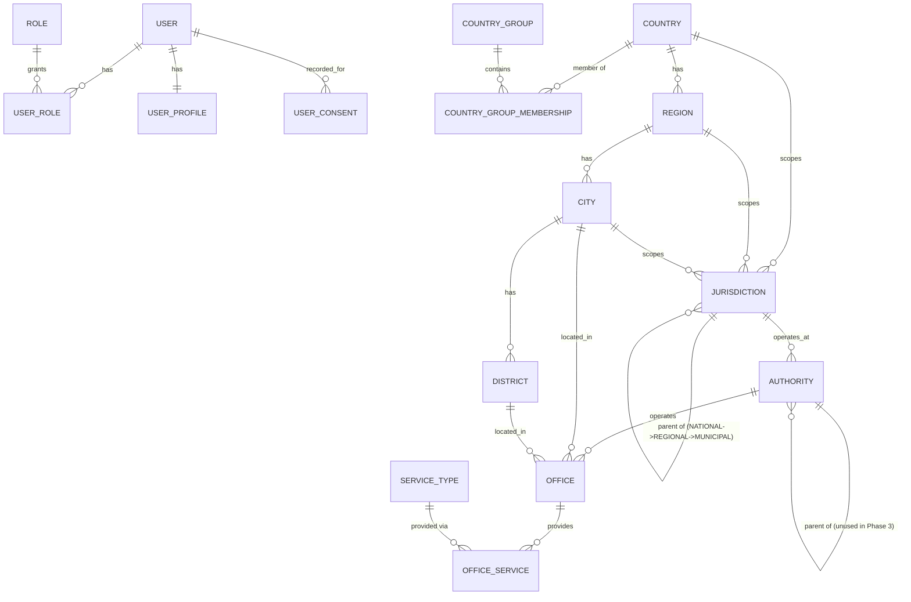
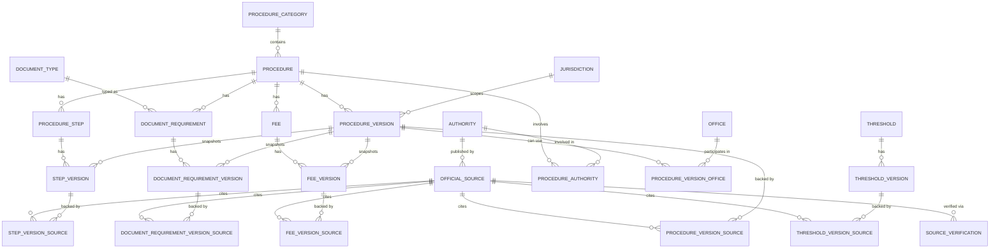
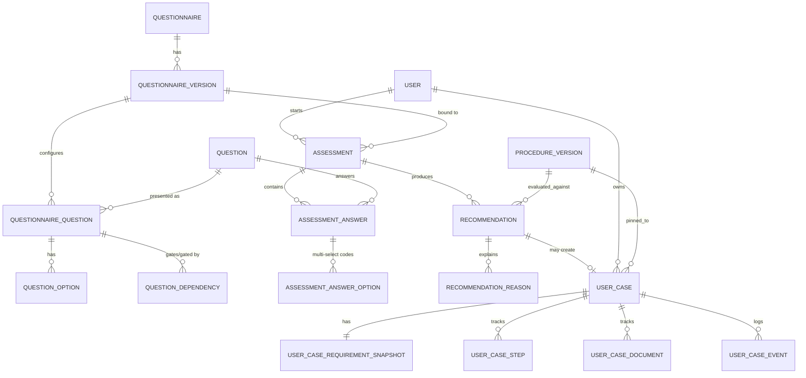

# Database Design — Foreigner Warsaw

Status: DRAFT (Phase 0 design) — §2 (Geographic / reference entities) IMPLEMENTED as of Phase 3; §3 (Procedure / content entities) IMPLEMENTED as of Phase 4
Last updated: 2026-09-02

Companion to [ARCHITECTURE.md](../architecture/ARCHITECTURE.md) §4/§7/§8 — this document
is the schema-level source of truth; ARCHITECTURE.md's entity list points here for
detail. PostgreSQL 18, Flyway-migrated (ADR-002).

## 0. Conventions used throughout this document

These four patterns recur across almost every entity group below; naming them once
avoids repeating the rationale forty times.

### Identity + Version split

Legally significant content (`Procedure`, `ProcedureStep`, `DocumentRequirement`, `Fee`,
`Threshold`, `Rule`) is modeled as a stable **identity** row (has a permanent `code`,
never changes meaning) plus append-only **version** rows (`ProcedureVersion`,
`StepVersion`, `DocumentRequirementVersion`, `FeeVersion`, `ThresholdVersion`,
`RuleVersion`) carrying the actual content, `effective_from`/`effective_to`, `status`,
and `source_id`. A version row is **never** updated after creation except to close its
`effective_to` or move it through the status lifecycle (§4). This is ADR-004 at the
column level.

Each `*Version` child of a `ProcedureVersion` (steps, documents, fees) is a **full
snapshot copied at draft-creation time**, not a diff — even fields that didn't change
get a new row. This trades a small amount of duplication (these are short content rows,
not large blobs) for a much simpler guarantee: "give me everything shown to a user under
`ProcedureVersion` X" is one join, never a diff-reconstruction.

### The Active-Version Predicate

Every place the **production** rules/recommendation/procedure-display code reads a
`*Version` table, it applies the same filter — this is the mechanism behind Deliverable
requirements §9 (publication safety) and §10 (temporal evaluation):

```sql
WHERE status = 'PUBLISHED'
  AND effective_from <= :evaluationDate
  AND (effective_to IS NULL OR effective_to > :evaluationDate)
```

`DRAFT` / `IN_REVIEW` / `APPROVED` rows are invisible to this predicate no matter what —
an admin can draft and even approve a change weeks in advance without any risk of it
leaking into production output, because only the `PUBLISHED` transition (§4) makes a row
reachable at all, and even then only once its own `effective_from` arrives. `:evaluationDate`
defaults to "now" for a live assessment, but a `UserCase` stores the evaluation date and
the exact version IDs it was built from (§8.5), so a historical case can be replayed
using its own stored date/versions instead of today's — this is what makes old cases
reproducible even after the law changes.

### Business codes alongside UUIDs

Every entity referenced from a rule condition, a URL, or another document uses a UUID
primary key **plus** a stable, human-assigned `code` (`Country.code = PK`,
`Procedure.code = TEMP_RESIDENCE_WORK`, `Question.code = CURRENT_LEGAL_STATUS`,
`Rule.code = TR_WORK_BASE_ELIGIBILITY`, `Threshold.code = BLUE_CARD_MIN_SALARY`). The
UUID is what foreign keys use internally; the code is what a `RuleCondition` JSON
document, an admin screen, or a public URL segment uses, so rule definitions and support
conversations stay human-legible without a UUID lookup. Purely internal join/log tables
(`UserCaseEvent`, `AuditLog`, `RuleThresholdReference`) skip the code — nothing external
ever needs to refer to one of those rows by name.

### Delete behavior

- **Legal-content identities and versions** (Procedure, Rule, DocumentRequirement, Fee,
  Threshold and their `*Version`s, `OfficialSource`): never hard-deleted. Retirement is
  `is_active = false` (identity) or `status = 'ARCHIVED'` (version). This is required by
  ADR-004 and by the "show old cases as they were" requirement.
- **User accounts**: soft-deleted (`status = 'DELETED'`, PII columns nulled/scrubbed) to
  satisfy GDPR erasure while preserving referential integrity for `UserCase`/`AuditLog`
  rows that point at the user ID (tombstone, not orphaned FK).
- **Session-like / ephemeral data** (`EmailVerificationToken`, `PasswordResetToken`,
  superseded `Recommendation` rows): hard-deleted or naturally expired; no legal
  traceability requirement applies to them.
- **Everything else** (`UserProfile`, `NotificationPreference`, `Office`): ordinary
  mutable rows with `updated_at`; not append-only, since they represent current
  operational facts rather than legal history — see §3's note on why `Office` doesn't get
  a full version table.

---

## 1. Core user / security entities

### User
- **Purpose**: account identity and credentials.
- **Key columns**: `id UUID PK`, `email CITEXT NOT NULL`, `password_hash`,
  `email_verified_at NULL`, `status ENUM(ACTIVE, SUSPENDED, DELETED)`, `created_at`,
  `updated_at`.
- **Unique**: `UNIQUE(email)` on the case-insensitive `citext` column (or a functional
  `lower(email)` unique index if `citext` extension is undesired) — email uniqueness must
  not depend on case.
- **Indexes**: unique index on `email` (covers login lookups).
- **Delete**: soft-delete (§0).

### Role / UserRole
- **Role**: `id UUID PK`, `code UNIQUE` (`USER`, `ADMIN`, `CONSULTANT`,
  `LEGAL_REVIEWER`, `CONTENT_EDITOR`, `COMPANY_ADMIN` — only `USER`/`ADMIN` seeded in
  MVP), `name`.
- **UserRole**: composite `PK(user_id, role_id)`, both FK, `granted_at`, `granted_by FK
  → User NULL`.

### UserProfile
- **Purpose**: durable "Complete your profile" facts, reused as defaults across
  assessments — distinct from `AssessmentAnswer`, which is an immutable per-assessment
  snapshot even when it happens to match the profile.
- **Key columns**: `id UUID PK`, `user_id UUID UNIQUE FK → User`, `first_name NULL`,
  `preferred_locale`, `citizenship_country_id FK → Country NULL`,
  `current_city_id FK → City NULL`, `date_of_birth NULL`, `updated_at`.

### EmailVerificationToken / PasswordResetToken
- **Purpose**: single-use, expiring tokens for the two flows in Product Requirements
  §6.1.
- **Key columns** (both tables, same shape): `id UUID PK`, `user_id FK → User`,
  `token_hash UNIQUE` (store a hash, never the raw token), `expires_at`, `used_at NULL`,
  `created_at`.
- **Delete**: hard-deleted by a scheduled cleanup once expired/used; no history value.

### UserConsent
- **Purpose**: provable GDPR consent trail (ToS, Privacy Policy, optional marketing).
- **Key columns**: `id UUID PK`, `user_id FK → User`, `consent_type ENUM
  (TERMS_OF_SERVICE, PRIVACY_POLICY, MARKETING_EMAILS)`, `policy_version` (the ToS/Privacy
  text version accepted), `accepted_at`, `ip_address NULL`.
- **Versioning**: append-only — a new policy version requires a new consent row, the old
  one is never overwritten (this row *is* the audit record).

---

## 2. Geographic / reference entities

**Status: IMPLEMENTED (Phase 3)** — everything in this section reflects the actual
migrated schema (`V7`–`V17`) and JPA entities under `reference.{country,geography,authority}`,
not the Phase 0 speculative sketch. Where Phase 3 refined or deviated from Phase 0's
original design, that's called out explicitly below; see
[ADR-006](../architecture/ADR/ADR-006-country-classification.md) and
[REFERENCE_DATA_SOURCES.md](../reference/REFERENCE_DATA_SOURCES.md) for the full
rationale and seed-data provenance.

The hierarchy required — `Poland → Mazowieckie → Warsaw → district → office`, extensible
to `Poland → Małopolskie → Kraków` — is split into two layers that are easy to conflate
but serve different purposes:

- **Geography** (`Country`, `Region`, `City`, `District`) is *where a place is* — used
  for addresses, office locations, and routing a user to the right district office.
- **Jurisdiction** is *at what legal/procedural scope a rule, procedure, or authority
  operates* — National / Regional / Municipal — and is what `Procedure`, `Rule`, and
  `Authority` actually reference. This is the schema form of ARCHITECTURE.md §9's
  three-layer model.

A deliberate naming departure from the original brief: the brief lists "Voivodeship" as
its own entity. It's implemented here as `Region` with a `region_type` column
(`VOIVODESHIP` today) rather than a table literally named `Voivodeship`, because the
entire point of §84 of the originating brief is that Poland's administrative-division
concept must not be baked into the schema — a future German city's `Land` or French
`région` is another `Region` row with a different `region_type`, not a new table or a
code change. "Voivodeship" survives as data, not as structure.

**A naming note that trips people up**: every table below stores its display name in a
`canonical_name` column (not `name`) — that's the Phase 0 convention, kept for
consistency with `Procedure`/`Rule`/etc. elsewhere in this document. The public JSON API
(`/api/v1/reference/**`) exposes that same value under a `name` key in every response DTO
(`CountryResponse.name`, `RegionResponse.name`, ...) — deliberately minimal and
consistent across all six reference DTOs (brief §23), and simply a different name at the
HTTP boundary than at the column level. Don't confuse the two when reading a migration
next to a controller.

**Reference-data temporal convention (ADR-006), different from §0's Active-Version
Predicate**: every table below with `valid_from`/`valid_to` treats `valid_to` as
**inclusive** (`valid_to IS NULL OR valid_to >= evaluationDate`), not the exclusive
`effective_to` legal-content versioning uses in §0. Reference data is a plain mutable
fact corrected over time, not append-only legal history — there is no `status` lifecycle
and no separate identity/version split here at all.

### Country
- `id UUID PK`, `code VARCHAR(2) UNIQUE NOT NULL` (ISO 3166-1 alpha-2 — `VARCHAR`, not
  `CHAR`: these are identifiers compared for equality, not fixed-width display fields),
  `alpha3_code VARCHAR(3) NULL` (unique when present), `numeric_code VARCHAR(3) NULL`,
  `canonical_name`, `active BOOLEAN NOT NULL DEFAULT true`, `display_order INT NULL`,
  `code_standard ENUM(ISO_3166_1, USER_ASSIGNED) NOT NULL DEFAULT 'ISO_3166_1'` (V18),
  `officially_assigned BOOLEAN NOT NULL DEFAULT true` (V18), `notes TEXT NULL` (V18),
  `created_at`, `updated_at`.
- **Index**: unique on `code`; unique partial index on `alpha3_code WHERE alpha3_code IS
  NOT NULL`.
- Seeded with all 250 entries of the ODbL-1.0 `mledoze/countries` dataset (Phase 3) — see
  REFERENCE_DATA_SOURCES.md. **Not all 250 are officially assigned ISO 3166-1 codes**:
  ISO 3166-1 currently has 249 officially assigned alpha-2 codes; the 250th seeded row is
  `XK` (Kosovo), a user-assigned code the ISO 3166 Maintenance Agency has never assigned.
  `code_standard`/`officially_assigned` (added post-Phase-3-approval, V18) make this a
  real, queryable fact rather than something only discoverable by reading the seed
  migration — `XK` is `USER_ASSIGNED`/`officially_assigned = false` with an explanatory
  `notes` value; every other row is `ISO_3166_1`/`officially_assigned = true` with `notes
  IS NULL`. Kosovo is kept, not removed, because it's operationally useful (e.g. as a
  country of citizenship) — see REFERENCE_DATA_SOURCES.md.

### CountryGroup / CountryGroupMembership
- **CountryGroup**: `id UUID PK`, `code UNIQUE` (`EU_MEMBER`, `EEA`, `EFTA`, `SCHENGEN`,
  `EU_EEA_SWISS`), `name`, `description NULL`, `group_type ENUM(LEGAL, CONVENIENCE)`,
  `active`. `group_type` distinguishes groups with independent legal meaning
  (`EU_MEMBER`/`EEA`/`EFTA`/`SCHENGEN`) from `EU_EEA_SWISS`, a `CONVENIENCE` grouping that
  exists only to label "the free-movement area as a whole" for display — it carries no
  independent classification weight (see `CountryClassificationService`'s
  `EU_EEA_SWISS_FREE_MOVEMENT_GROUPS` constant, which checks only the three `LEGAL`
  groups `EU_MEMBER`/`EEA`/`EFTA` — deliberately excluding both `SCHENGEN`, which is
  border-control cooperation and never a residence-rights signal, and the derived
  `EU_EEA_SWISS` aggregate itself, to avoid circularity). **No `THIRD_COUNTRY` group and
  no `UK_WITHDRAWAL_AGREEMENT` group are ever rows here** — both are derived/person-level
  facts, not country-level ones — see ADR-006, including its "Why not a universal legal
  boolean" section on why the corresponding service method is deliberately *not* named
  after a legal term.
- **CountryGroupMembership**: `id UUID PK`, `country_id FK → Country`,
  `country_group_id FK → CountryGroup`, `valid_from DATE NOT NULL`, `valid_to DATE NULL`
  (**inclusive** — see this section's temporal-convention note above, and ADR-006),
  `provenance_status ENUM(VERIFIED, DRAFT) NOT NULL DEFAULT 'VERIFIED'` (V19).
  Membership is **time-bounded on purpose** — the UK's EU membership ending
  2020-01-31 is the textbook case a static membership table would get wrong for any
  pre-2020 historical evaluation; V11 seeds this exact row
  (`GB, EU_MEMBER, 1973-01-01..2020-01-31`). `provenance_status` (added
  post-Phase-3-approval, V19) is `DRAFT` for every row with `valid_from < 2000-01-01`
  (compiled from general historical knowledge, not one authoritative per-date source —
  V11's own original migration comment) and `VERIFIED` for everything else, making that
  confidence level queryable rather than only a comment — see ADR-006's "Membership
  provenance" section.
- **Index**: `(country_group_id, valid_from, valid_to)` for "who is in the EU as of date
  X"; `(country_id)` for "what groups is this country in" — both realized as the JPQL
  queries `findActiveMembershipsForGroup`/`findActiveMembershipsForCountry`.
- This table is what
  `CountryClassificationService.isOutsideEuEeaSwissFreeMovementGroup(code, date)`
  derives its answer from — application code asks "is this country a member of
  `EU_MEMBER`/`EEA`/`EFTA` as of today," never `if (country == "DE")`. That method is a
  narrow structural fact, not a legal "third-country national" determination — see
  ADR-006.

### Region, City, District
- **Region**: `id UUID PK`, `country_id FK → Country`, `code` (`MAZOWIECKIE`,
  `MALOPOLSKIE`, ...), `canonical_name`, `region_type` (`VOIVODESHIP`, ...), `active
  BOOLEAN NOT NULL DEFAULT true`, `valid_from DATE NOT NULL DEFAULT '1999-01-01'`,
  `valid_to NULL`. Unique `(country_id, code)`. All 16 Polish voivodeships are seeded
  (Phase 3), not just Mazowieckie — cheap, stable reference data that de-risks future
  city expansion (brief §26).
- **City**: `id UUID PK`, `country_id FK → Country` (denormalized from `region_id` — see
  the column comment in `V12__create_geography.sql` for the one case this could drift),
  `region_id FK → Region`, `code` (`WARSAW`, `KRAKOW`), `canonical_name`, `active BOOLEAN
  NOT NULL DEFAULT false`, `valid_from`, `valid_to NULL`. Unique `(region_id, code)`.
  **`active` defaults to `false`, the one entity in this section where the default is
  "off"** — this is literally how "Warsaw is the only enabled city in V1" is implemented
  (ARCHITECTURE.md §9): enabling Kraków later is flipping this flag plus seeding its
  districts/offices, not a deployment.
- **District**: `id UUID PK`, `city_id FK → City`, `code`, `canonical_name`, `active`,
  `valid_from`, `valid_to NULL`. Unique `(city_id, code)`. All 18 official Warsaw
  districts (dzielnice) are seeded, Polish diacritics preserved in `canonical_name`
  (brief §62 — display names are never ASCII-normalized).

### Jurisdiction
- **Purpose**: the legal/procedural scope a `Procedure`, `Rule`, or `Authority` operates
  at.
- **Refined from Phase 0's original flat-FK sketch into a self-referencing tree** — the
  concrete need was walking "Warsaw → its parent Mazowieckie → its parent Poland" without
  three independent lookups, and a tree is the natural shape for that, not a modeling
  afterthought.
- **Key columns**: `id UUID PK`, `code UNIQUE` (`PL`, `PL_MAZOWIECKIE`,
  `PL_MAZOWIECKIE_WARSAW`), `name`, `jurisdiction_type ENUM(NATIONAL, REGIONAL,
  MUNICIPAL)`, `parent_jurisdiction_id FK → Jurisdiction NULL` (self-referencing — `NULL`
  only for the `NATIONAL` root), `country_id FK → Country NOT NULL`,
  `region_id FK → Region NULL`, `city_id FK → City NULL` (`region`/`city` are still
  carried directly, denormalized off the tree, so "find the jurisdiction for Warsaw" is a
  plain indexed lookup rather than a recursive walk — a hybrid design, not purely one or
  the other), `active`, `valid_from`, `valid_to NULL`.
- **Constraint**: `CHECK` — `NATIONAL` requires `region_id IS NULL AND city_id IS NULL
  AND parent_jurisdiction_id IS NULL`; `REGIONAL` requires `region_id IS NOT NULL AND
  city_id IS NULL AND parent_jurisdiction_id IS NOT NULL`; `MUNICIPAL` requires
  `city_id IS NOT NULL AND parent_jurisdiction_id IS NOT NULL`.
- Seeded chain: `PL` (NATIONAL, no parent) → `PL_MAZOWIECKIE` (REGIONAL, parent `PL`) →
  `PL_MAZOWIECKIE_WARSAW` (MUNICIPAL, parent `PL_MAZOWIECKIE`).
- Most immigration-eligibility `Procedure`s are `NATIONAL` even though *processing*
  happens at the Mazowieckie voivodeship office — see §7's example of composing a
  National rule with Regional and Municipal presentation data on the same page.

### Authority
- **Purpose**: an institution with a legal mandate (UDSC, Mazowieckie Voivodeship
  Office, City of Warsaw), as opposed to `Office`, which is a physical place that
  institution operates.
- `id UUID PK`, `code UNIQUE` (`UDSC`, `MAZOWIECKIE_VOIVODESHIP_OFFICE`,
  `WARSAW_CITY_HALL`), `canonical_name`, `authority_type VARCHAR(50)` (free-form, not an
  enum — the brief gave no fixed vocabulary, and inventing one prematurely risks being
  wrong for a future country's institutional structure), `jurisdiction_id FK →
  Jurisdiction NOT NULL`, `parent_authority_id FK → Authority NULL` (self-referencing,
  for a future sub-office hierarchy — `NULL` for every Phase 3 seed row, no concrete
  example verified yet), `official_website NULL`, `active`, `valid_from`, `valid_to
  NULL`. Seeded: one `NATIONAL_AGENCY` (UDSC), one `REGIONAL_OFFICE` (Mazowieckie
  Voivodeship Office), one `MUNICIPAL_GOVERNMENT` (Warsaw City Hall) — one per
  jurisdiction level, deliberately.

### Office / OfficeService (ServiceType) / ProcedureOffice
- **Office**: `id UUID PK`, `authority_id FK → Authority NOT NULL`, `canonical_name`,
  `street NULL`, `building_number NULL`, `postal_code NULL`, `city_id FK → City NOT
  NULL`, `district_id FK → District NULL`, `phone NULL`, `email NULL`, `website NULL`,
  `opening_hours JSONB NULL` (genuinely irregular per-office schedules — a justified
  JSONB use, see §6 — **deliberately unpopulated in Phase 3**: no source was verified
  specifically for current hours, only for address/contact facts), `appointment_required
  BOOLEAN NULL`, `booking_url NULL`, `source_url NULL`, `last_verified_at NULL`, `notes
  TEXT NULL`, `active`, `valid_from`, `valid_to NULL`. No `latitude`/`longitude` columns
  yet (deferred — no map-based feature consumes them yet). Deliberately **not** a full
  identity+version entity like Procedure/Rule: an office's address is an operational fact
  admins correct, not a legal position that needs DRAFT→PUBLISHED review —
  `valid_from`/`valid_to` plus `source_url`/`last_verified_at` is enough to know "when
  did we believe this was the address, and against what," without the heavier workflow
  (§0's delete/version conventions). **Seeded conservatively: exactly one office record**
  (the Mazowieckie Wydział Spraw Cudzoziemców, re-verified directly against its primary
  source on 2026-09-02) — seeding fewer, verified records rather than inventing
  plausible-looking ones for offices not actually checked (brief's own instruction).
- **ServiceType**: `id UUID PK`, `code UNIQUE` (`PESEL`, `MELDUNEK`, `DRIVING_LICENCE`,
  `IMMIGRATION_INFORMATION`), `name`, `description NULL`, `active`. **A genuine deviation
  from Phase 0's sketch**, which embedded `service_code` directly on the join row —
  Phase 3 promotes it to its own reference entity so a service's `name`/`description` has
  one place to live, not one per office that happens to offer it.
- **OfficeService**: pure join row, composite key — `office_id FK`, `service_type_id
  FK`, `PRIMARY KEY(office_id, service_type_id)`, `active`, `notes NULL`. Modeled as a
  JPA `@EmbeddedId` entity (not a derived `@ManyToMany`) specifically so `active`/`notes`
  have somewhere to live per pairing. Named `OfficeService` per this phase's own brief
  (§14) despite the collision risk with a hypothetical "office lookup" application
  service class — the corresponding Spring `@Service` is named `OfficeLookupService`
  precisely to avoid that collision.
- **ProcedureOffice**: not yet implemented — deferred to Phase 4+, when a `Procedure`
  identity exists for it to reference. Design intent unchanged from Phase 0's original
  sketch (below).
  - *(Phase 0 design, unimplemented)*: `procedure_id FK → Procedure`, `office_id FK →
    Office`, `valid_from`, `valid_to NULL`, `notes` — explicit "this office handles this
    specific procedure" mapping (e.g. Śródmieście district office for PESEL applicants
    without a registerable address). References the `Procedure` identity, not a specific
    `ProcedureVersion` — office routing is administrative, not legal content.

---

## 3. Procedure / content entities

**Status: IMPLEMENTED (Phase 4)** — this section reflects the actual migrated schema
(`V20`–`V34`) and JPA entities under `procedure.{category,core,step,document,fee,
threshold,source,authority}`, not the Phase 0 speculative sketch. See
[ADR-007](../architecture/ADR/ADR-007-versioned-procedure-content.md) for the identity+
version rationale,
[CONTENT_PUBLISHING_WORKFLOW.md](../product/CONTENT_PUBLISHING_WORKFLOW.md) for the
publish state machine and validation, and
[SOURCE_VERIFICATION_POLICY.md](../legal-sources/SOURCE_VERIFICATION_POLICY.md) for
source provenance policy.

### ProcedureCategory
- `id UUID PK`, `code UNIQUE` (`RESIDENCE`, `EU_FREE_MOVEMENT`, `WORK`, `STUDY`,
  `FAMILY`, `LONG_TERM_RESIDENCE`, `PROTECTION`, `IDENTITY_REGISTRATION`, `DRIVING`,
  `BUSINESS`, `OTHER`), `canonical_name`, `description NULL`, `display_order`, `active`.
  **Deliberately flat, no `parent_category_id`** (a deviation from the Phase 0 sketch) —
  a hierarchy isn't needed by anything yet and can be added later without changing this
  table's shape (brief §5: design for multi-category tagging without prematurely
  implementing it).

### Procedure (identity)
- `id UUID PK`, `code UNIQUE` (`TEMP_RESIDENCE_WORK`), `category_id FK →
  ProcedureCategory NOT NULL`, `canonical_name`, `short_description NULL`,
  `procedure_type VARCHAR(50) NULL` (free-form, no fixed vocabulary given - same
  reasoning as `Authority.authority_type`), `jurisdiction_scope
  ENUM(NATIONAL, REGIONAL, MUNICIPAL, MIXED)`, `active`, `created_at`, `updated_at`.
  **No `jurisdiction_id` FK here** (a deviation from the Phase 0 sketch, which had one) —
  `jurisdiction_scope` is the procedure's own descriptive classification;
  `ProcedureVersion.jurisdiction_id` (below) is the actual anchor jurisdiction, since
  which specific jurisdiction row applies is a fact about a version's content, not the
  bare identity.

### ProcedureVersion
- `id UUID PK`, `procedure_id FK → Procedure NOT NULL`, `version_number INT`, `title`,
  `summary NULL`, `description NULL`, `status ENUM(DRAFT, IN_REVIEW, APPROVED,
  PUBLISHED, ARCHIVED)` (shared `PublicationStatus` enum, not procedure-specific),
  `effective_from DATE NULL` (nullable at DRAFT; required by application validation
  before PUBLISHED), `effective_to DATE NULL`, `jurisdiction_id FK → Jurisdiction NULL`,
  `change_summary NULL`, `created_by/submitted_by/approved_by/published_by FK → User
  NULL` (`ON DELETE SET NULL` — a departed admin's history is kept, not cascaded away),
  `submitted_at/approved_at/published_at NULL`, `created_at`, `updated_at`,
  `lock_version BIGINT` (Hibernate `@Version` optimistic-lock counter — a different
  concept from `version_number`, the business-visible "Version 1/2/3").
  **No `eligibility_rule_id` or `source_id` column** (deviations from the Phase 0
  sketch): the former doesn't exist because Phase 6's `Rule` table doesn't exist yet
  (brief §16's "avoid speculative foreign keys"); the latter is replaced by the
  many-to-many `procedure_version_sources` association below (brief §26: "a legal
  requirement may have more than one source").
- **Unique**: `(procedure_id, version_number)`.
- **Integrity beyond a plain unique constraint**: published versions of the same
  procedure must not have overlapping effective ranges (§0's Active-Version Predicate —
  here using the same **exclusive** `effective_to` convention as every other
  legal-content table, deliberately different from reference data's inclusive
  `valid_to`, ADR-006). Enforced with a PostgreSQL exclusion constraint using the
  `btree_gist` extension: `EXCLUDE USING gist (procedure_id WITH =,
  daterange(effective_from, effective_to) WITH &&) WHERE (status = 'PUBLISHED')`.
  Postgres's `daterange` defaults to `[)` (lower-inclusive, upper-exclusive), which
  matches this exact convention with no explicit bound argument needed.
- **Index**: `(procedure_id, status)`, `(effective_from, effective_to)` — the
  Active-Version Predicate's lookup path.
- **Found the hard way**: publishing a new version must close the previously-active
  version's `effective_to` *and flush that write* before the new version's own
  PUBLISHED update, or Hibernate's flush ordering can send the two in the wrong order
  and the exclusion constraint rejects the new version against the *old*, still
  open-ended range - see `ProcedurePublishingService#publish`'s Javadoc.

### ProcedureStep (identity) / StepVersion
- **ProcedureStep**: `id UUID PK`, `procedure_id FK → Procedure NOT NULL`,
  `stable_code`, `created_at`. Unique `(procedure_id, stable_code)`.
- **StepVersion**: `id UUID PK`, `procedure_step_id FK → ProcedureStep NOT NULL`,
  `procedure_version_id FK → ProcedureVersion NOT NULL`, `title`, `description NULL`,
  `detailed_instructions NULL`, `step_type ENUM(INFORMATION, PREPARATION, DOCUMENT,
  PAYMENT, ONLINE_SUBMISSION, IN_PERSON_SUBMISSION, APPOINTMENT, BIOMETRICS, WAITING,
  ADDITIONAL_DOCUMENTS, DECISION, COLLECTION, OTHER)`, `sort_order INT`, `mandatory
  BOOLEAN`, `online_available BOOLEAN NULL`, `requires_appointment BOOLEAN NULL`,
  `expected_user_action NULL`, `jurisdiction_id FK → Jurisdiction NULL` (content-overlay
  hook, brief §112-114 — `NULL` inherits the parent version's own jurisdiction; set only
  when a step's content genuinely belongs to a narrower jurisdiction). No independent
  `status` column — mirrors the parent `ProcedureVersion`'s lifecycle, as Phase 0
  originally sketched.
- **Unique**: `(procedure_version_id, procedure_step_id)` (a new version structurally
  requires its own `StepVersion` rows — no silent fallback to a prior version's steps)
  and `(procedure_version_id, sort_order)` (deterministic ordering, brief §14).

### DocumentType / DocumentRequirement (identity) / DocumentRequirementVersion
- **DocumentType** (new in Phase 4, not in the Phase 0 sketch — brief §18): `id UUID
  PK`, `code UNIQUE` (`PASSPORT`, `PHOTO`, `EMPLOYMENT_CONTRACT`, ...), `canonical_name`,
  `description NULL`, `active`. A reusable document *concept*, distinct from a
  procedure-specific requirement.
- **DocumentRequirement**: `id UUID PK`, `procedure_id FK → Procedure NOT NULL`,
  `stable_code`, `document_type_id FK → DocumentType NULL`, `created_at`. Unique
  `(procedure_id, stable_code)`.
- **DocumentRequirementVersion**: `id UUID PK`, `document_requirement_id FK →
  DocumentRequirement NOT NULL`, `procedure_version_id FK → ProcedureVersion NOT NULL`,
  `name`, `description NULL`, `requirement_type ENUM(DEFAULT_REQUIRED, CONDITIONAL,
  INFORMATIONAL)` (replaces the Phase 0 sketch's `required`/`conditional` booleans plus
  a `condition_rule_id FK → Rule` — brief §16 explicitly forbids a speculative FK to a
  table that doesn't exist yet; `CONDITIONAL` alone carries the forward-compatible
  signal), `required_by_default BOOLEAN`, `number_of_copies INT NULL`,
  `original_required/copy_required/translation_required/sworn_translation_required/
  apostille_required/legalisation_required BOOLEAN NULL`,
  `validity_period_description VARCHAR(300) NULL` (free text, not a structured
  duration — brief §17: "do not convert complex legal statements into oversimplified
  booleans if that loses meaning"), `notes NULL`, `sort_order INT`. No independent
  `status` — mirrors the parent version, as with `StepVersion`.
- **Unique**: `(procedure_version_id, document_requirement_id)`.

### Fee (identity) / FeeVersion
- **Fee**: `id UUID PK`, `procedure_id FK → Procedure NOT NULL`, `stable_code`,
  `fee_type ENUM(APPLICATION, STAMP_DUTY, RESIDENCE_CARD, DOCUMENT_ISSUANCE, OTHER)`,
  `created_at`. Unique `(procedure_id, stable_code)`.
- **FeeVersion**: `id UUID PK`, `fee_id FK → Fee NOT NULL`, `procedure_version_id FK →
  ProcedureVersion NOT NULL`, `amount NUMERIC(10,2)` (`BigDecimal`, never
  float/double, brief §104), `currency VARCHAR(3)`, `description NULL`,
  `payment_instructions NULL`, `refundable BOOLEAN NULL`. **Snapshotted per
  `ProcedureVersion`, not independently versioned** (brief §20's choice, matching
  DATABASE.md's original design) — a fee's temporal validity is then identical to its
  parent version's, so no separate exclusion constraint or `status` column is needed;
  "the fee that applied on date X" is just "the `FeeVersion` belonging to the
  `ProcedureVersion` active on date X" (brief §49's snapshot-readiness, for free).
- **Unique**: `(procedure_version_id, fee_id)`.

### Threshold (identity) / ThresholdVersion
- **Threshold**: `id UUID PK`, `code UNIQUE` (e.g. a future `BLUE_CARD_MIN_SALARY`),
  `canonical_name`, `value_type ENUM(DECIMAL, INTEGER, PERCENTAGE, DURATION, MONEY,
  TEXT)`, `unit NULL`, `currency NULL`, `active`.
- **ThresholdVersion**: `id UUID PK`, `threshold_id FK → Threshold NOT NULL`,
  `value NUMERIC(18,4) NULL`, `value_text NULL` (exactly one of the two populated,
  per `value_type` — two nullable columns, not a fully generic EAV design, brief §21),
  `status`/`effective_from`/`effective_to`/actor+timestamp columns/`lock_version` —
  the identical independent identity+version+exclusion-constraint pattern as
  `ProcedureVersion`, since a `Threshold` (unlike `Fee`) isn't owned by any one
  procedure. **No rows are seeded** (brief §21/§53 — never seed unverified legal
  numeric thresholds); this migration only builds the engine, ready for Phase 6.
  **Not yet exposed through a dedicated internal HTTP API** (brief §43's "defer UI/API
  breadth" — no threshold value exists yet for an admin to manage through one); proven
  at the service/repository layer instead (`ThresholdVersionRepositoryTest`,
  `ThresholdService`).

### OfficialSource / SourceVerification
- **OfficialSource**: `id UUID PK`, `authority_id FK → Authority NULL`, `title`,
  `source_url VARCHAR(500)` (`CHECK` constraint requiring `http(s)://`, brief §61),
  `jurisdiction_id FK → Jurisdiction NULL`, `language VARCHAR(5) NULL`,
  `source_type ENUM(LEGISLATION, GOVERNMENT_GUIDANCE, OFFICIAL_SERVICE_PAGE,
  OFFICIAL_FORM, OFFICIAL_FEE_SCHEDULE, OFFICIAL_NOTICE, OTHER_OFFICIAL)` (brief §23 —
  never `BLOG`/`REDDIT`/`LAW_FIRM`), `publication_date/effective_from/effective_to
  DATE NULL`, `last_checked_at/last_verified_at TIMESTAMPTZ NULL`,
  `verification_status ENUM(DRAFT, VERIFIED, NEEDS_REVIEW, OUTDATED, ARCHIVED)`,
  `content_hash VARCHAR(128) NULL` (change-detection metadata only, brief §50 — never
  itself evidence of verification), `notes NULL`, `active`, `created_at`, `updated_at`.
  See [SOURCE_VERIFICATION_POLICY.md](../legal-sources/SOURCE_VERIFICATION_POLICY.md)
  for the full policy.
- **SourceVerification**: `id UUID PK`, `official_source_id FK → OfficialSource NOT
  NULL` (`ON DELETE CASCADE` — a verification record has no meaning without its
  source), `checked_at TIMESTAMPTZ`, `checked_by FK → User NULL`,
  `status` (same `VerificationStatus` vocabulary), `notes NULL`,
  `observed_hash VARCHAR(128) NULL`, `change_detected BOOLEAN`,
  `previous_verification_id FK → SourceVerification NULL` — the append-only log behind
  `OfficialSource.last_verified_at`.

### Content → source provenance associations
Five small, real-FK join tables (brief §25's "maintainability over clever polymorphic
SQL" — a deliberate departure from a single polymorphic `content_type`/`content_id`
association table): `procedure_version_sources`, `step_version_sources`,
`document_requirement_version_sources`, `fee_version_sources`,
`threshold_version_sources`. Each: `(<content>_id, official_source_id)` composite PK,
`role ENUM(PRIMARY, SUPPORTING, OPERATIONAL)` (brief §26 — a requirement may cite
legislation as `PRIMARY` plus a government explanatory page as `SUPPORTING`). Modeled as
JPA `@EmbeddedId` join entities, the same pattern as Phase 3's `OfficeService`.

### ProcedureAuthority / ProcedureVersionOffice
- **ProcedureAuthority** (new in Phase 4, brief §30): `procedure_id FK → Procedure`,
  `authority_id FK → Authority`, `role ENUM(LEGAL_AUTHORITY, PROCESSING_AUTHORITY,
  MUNICIPAL_AUTHORITY, INFORMATION_AUTHORITY)`, `notes NULL`. Composite PK includes
  `role`, so the same authority can hold more than one role. Kept at the `Procedure`
  identity level (not per-version) — which authorities are involved changes rarely,
  never as a side effect of ordinary content edits.
- **ProcedureVersionOffice** (brief §31 — Phase 3 deliberately deferred this):
  `procedure_version_id FK → ProcedureVersion`, `office_id FK → Office`, `notes NULL`.
  Expresses only "this office can participate in this procedure," never "this specific
  user must go to this office" — routing by district/circumstances is a future phase's
  job. Tied to the version (not the bare procedure) since participating offices can
  genuinely change alongside a content update.
- **`ProcedureOffice` from the Phase 0 sketch is superseded by `ProcedureVersionOffice`**
  above — the name changed to make explicit that office participation is a fact about a
  specific version's content, not the procedure's bare identity.

---

## 4. Questionnaire entities (Phase 5, ADR-008 — supersedes an earlier draft of this
section that sketched a version-less `Questionnaire`/nullable-`user_id` `Assessment`;
neither had been built yet when Phase 5's brief specified the opposite on both points)

### Questionnaire (identity) / QuestionnaireVersion
- **Questionnaire**: `id UUID PK`, `code UNIQUE` (`WARSAW_GENERAL_ASSESSMENT`),
  `canonical_name`, `active`, `created_at`, `updated_at`. Answers only "which
  questionnaire is this" — all content lives on `QuestionnaireVersion`.
- **QuestionnaireVersion**: the same identity+version+publication-lifecycle pattern as
  `Procedure`/`ProcedureVersion` (§3, ADR-007) — `id UUID PK`,
  `questionnaire_id FK → Questionnaire`, `version_number`, `title`, `description`,
  `status` (reuses `PublicationStatus`: `DRAFT → IN_REVIEW → APPROVED → PUBLISHED →
  ARCHIVED`, not a separate enum), `effective_from`/`effective_to` (same EXCLUSIVE
  `effective_to`, btree_gist no-overlapping-PUBLISHED-ranges convention as procedure
  content), `created_by`/`submitted_by`/`approved_by`/`published_by FK → User`,
  matching timestamps, `lock_version` (optimistic lock). An `Assessment` binds
  permanently to one `QuestionnaireVersion.id` at creation and never re-resolves to a
  newer one while `IN_PROGRESS` — see ADR-008 for why this reversed the earlier
  version-less sketch.

### Question (identity) / QuestionnaireQuestion
- **Question**: `id UUID PK`, `code UNIQUE` (`CITIZENSHIP_COUNTRY`,
  `CURRENT_LEGAL_STATUS`, `PRIMARY_PURPOSE`, `MONTHLY_GROSS_SALARY` — see
  `docs/product/QUESTION_CODES.md` for the full seeded registry), `field_key UNIQUE`
  (the camelCase name a future `RuleCondition.field`/`AssessmentFacts` map key uses —
  e.g. `monthlyGrossSalary`), `question_type ENUM(BOOLEAN, SINGLE_SELECT, MULTI_SELECT,
  TEXT, INTEGER, DECIMAL, DATE, COUNTRY, REGION, CITY, DISTRICT)`,
  `semantic_data_type ENUM(GENERIC, MONEY)` nullable (what the answer *means*,
  independent of its widget — e.g. `MONTHLY_GROSS_SALARY` is a `DECIMAL` widget whose
  semantic meaning is `MONEY`), `unit` nullable (`PLN_MONTHLY_GROSS`), `active`. Not
  coupled to any Angular type — the frontend wizard is a generic renderer driven by
  `question_type` + `QuestionOption` + `QuestionDependency`.
- **QuestionnaireQuestion**: the per-version presentation+gating configuration for one
  `Question` — `id UUID PK`, `questionnaire_version_id FK → QuestionnaireVersion`,
  `question_id FK → Question`, `section_code`, `label`, `help_text` nullable,
  `required`, `sort_order`, `option_source ENUM(STATIC, REFERENCE_COUNTRY,
  REFERENCE_REGION, REFERENCE_CITY, REFERENCE_DISTRICT)`, `allow_unsure`,
  `visibility_combinator ENUM(ALL, ANY)` (how this question's `QuestionDependency` rows
  combine when more than one exists). Kept separate from `Question` so the same
  semantic question can be reworded, re-sectioned, or re-gated across versions without
  ever renaming the stable `Question.code` rule conditions and answers key off.
  **Unique**: `(questionnaire_version_id, question_id)`.

### QuestionOption
- `id UUID PK`, `questionnaire_question_id FK → QuestionnaireQuestion`, `code`, `label`,
  `description` nullable, `sort_order`, `active`, `reference_value` nullable. Only for
  `option_source = STATIC` questions — a reference-backed question (`COUNTRY`/`REGION`/
  `CITY`/`DISTRICT`) resolves its options from the Phase 3 reference API instead, never
  duplicated here. **Unique**: `(questionnaire_question_id, code)`.

### QuestionDependency
- `id UUID PK`, `questionnaire_question_id FK → QuestionnaireQuestion` (the gated
  question), `depends_on_questionnaire_question_id FK → QuestionnaireQuestion`,
  `operator` (`com.foreignerwarsaw.common.evaluation.ComparisonOperator` — the same
  vocabulary Phase 6's `RuleCondition` will reuse via one shared
  `ConditionEvaluator`: `EQUALS, NOT_EQUALS, IN, NOT_IN, CONTAINS, NOT_CONTAINS, EXISTS,
  NOT_EXISTS, GREATER_THAN, GREATER_THAN_OR_EQUAL, LESS_THAN, LESS_THAN_OR_EQUAL,
  DATE_BEFORE, DATE_AFTER`), `expected_value JSONB` (a scalar for most operators, an
  array for `IN`/`NOT_IN`/`CONTAINS`/`NOT_CONTAINS`).
- Example: `MONTHLY_GROSS_SALARY.dependsOn(HAS_JOB_OFFER, EQUALS, true)`.
- Evaluated by `QuestionVisibilityService` — "should this question be shown," never the
  immigration Rules Engine (ADR-008).

### Assessment / AssessmentAnswer
- **Assessment**: `id UUID PK`, `user_id FK → User NOT NULL` (authenticated-only for
  Phase 5 — see ADR-008 for why this reversed the nullable/anonymous-session sketch),
  `questionnaire_version_id FK → QuestionnaireVersion` (bound permanently at creation),
  `questionnaire_id FK → Questionnaire` (denormalized from `questionnaire_version_id`
  purely to back the one-`IN_PROGRESS`-assessment-per-user-per-questionnaire partial
  unique index below), `status ENUM(IN_PROGRESS, COMPLETED, ABANDONED, SUPERSEDED)`,
  `started_at`, `completed_at` nullable, `last_updated_at`, `lock_version`. A partial
  unique index on `(user_id, questionnaire_id) WHERE status = 'IN_PROGRESS'` enforces
  "at most one active assessment per questionnaire identity per user" at the database
  level, not just in application code.
- **AssessmentAnswer**: `id UUID PK`, `assessment_id FK → Assessment`,
  `question_id FK → Question` (the *stable* identity, not `QuestionnaireQuestion` —
  Phase 6 reads answers by stable code across time, independent of which version asked
  it), typed nullable columns `string_value`/`boolean_value`/`integer_value`/
  `decimal_value`/`date_value`/`reference_code` (exactly one populated, matching the
  question's `question_type` — never one untyped JSONB/string value a rule engine has
  to parse; see ADR-008), `is_unsure` (the "I don't know" sentinel, distinct from "not
  yet answered"), `is_applicable` (recomputed by `QuestionVisibilityService` on every
  write in this assessment — `false` once this answer's question is no longer visible
  under the current answer set; the row itself is kept so re-showing the question
  restores the prior value, but `AssessmentFacts` and completion validation only ever
  consider `is_applicable = true` rows), `answered_at`. **Unique**:
  `(assessment_id, question_id)`.
- **AssessmentAnswerOption**: `id UUID PK`, `assessment_answer_id FK →
  AssessmentAnswer`, `option_code` — a join table for `MULTI_SELECT` answers, not a
  JSONB array (queryability). **Unique**: `(assessment_answer_id, option_code)`.

---

## 5. Rule-engine entities (IMPLEMENTED, Phase 6 — see ADR-009)

The design below is largely as originally sketched; differences from the Phase 0 draft
are called out inline. See [PHASE_6_REPORT.md](../product/PHASE_6_REPORT.md) for the full
implementation report.

### Design decision: JSONB condition tree, not fully normalized condition rows

**Chosen: `RuleVersion.condition_tree JSONB`**, not a `RuleCondition` table modeling the
`ALL`/`ANY`/leaf tree as rows.

| | Structured `RuleCondition` rows | JSONB condition tree (chosen) |
|---|---|---|
| Recursive `ALL`/`ANY` nesting | Needs adjacency-list or nested-set modeling; recursive CTEs to reconstruct | Native — a tree is just a tree |
| Read/evaluate a whole rule | Multi-join reconstruction, then still walk it in memory | One row fetch, walk in memory (evaluation happens in Java either way) |
| Write a whole rule (admin save) | Multi-row insert/diff logic | One row insert |
| "Which rules use threshold X" | Trivial `WHERE reference_code = X` | Needs a companion extraction table (below) |
| Schema enforces condition shape | Yes, via FKs/columns | No — enforced by application-level JSON Schema validation on write |

The condition tree is read and evaluated as a unit by the Java rules engine — nothing
ever needs SQL to filter *inside* a single rule's logic, only to filter *which rules to
load*. That asymmetry is exactly what JSONB is good at and what a fully normalized
adjacency-list table is bad at (ADR-003 already made this call for the runtime
representation; this is the same call for storage, for the same reason).

The one real objection — "if it's opaque JSON, how do I find every rule affected by a
threshold change before I edit it" — is answered with a narrow companion table rather
than by normalizing the whole tree:

**RuleThresholdReference**: `rule_version_id FK → RuleVersion`, `threshold_code`,
`PRIMARY KEY(rule_version_id, threshold_code)`. Populated by the application whenever a
`RuleVersion.condition_tree` is saved, by walking the JSON once and extracting every
`reference` value. Gives the admin UI "these N rules reference `BLUE_CARD_MIN_SALARY`"
as a plain indexed query, without parsing JSON at query time.

Condition tree shape (structurally validated by `ConditionTreeParser`, semantically by
`ConditionTreeValidator` — never by a database constraint):

```json
{
  "all": [
    { "fact": "CITIZENSHIP_COUNTRY", "operator": "IS_NOT_MEMBER_OF_COUNTRY_GROUP", "value": "EU_MEMBER" },
    { "fact": "GOALS", "operator": "CONTAINS", "value": "WORK" },
    { "fact": "MONTHLY_GROSS_SALARY", "operator": "GREATER_THAN_OR_EQUAL", "threshold": "BLUE_CARD_MIN_SALARY" }
  ]
}
```

Renamed from the Phase 0 sketch's `field`/`reference` to `fact`/`threshold` to match the
Fact Registry (§ below) and Phase 5's `QuestionDependency` vocabulary exactly — one
naming convention, not two. A `NOT` node was added (Phase 0 only listed `ALL`/`ANY`).

Operator vocabulary (fixed; `ComparisonOperator`, shared with `QuestionDependency`, §4):
`EQUALS`, `NOT_EQUALS`, `IN`, `NOT_IN`, `CONTAINS`, `NOT_CONTAINS`, `EXISTS`,
`NOT_EXISTS`, `GREATER_THAN`, `GREATER_THAN_OR_EQUAL`, `LESS_THAN`,
`LESS_THAN_OR_EQUAL`, `BETWEEN`, `DATE_BEFORE`, `DATE_BEFORE_OR_EQUAL`, `DATE_AFTER`,
`DATE_AFTER_OR_EQUAL`, `IS_MEMBER_OF_COUNTRY_GROUP`, `IS_NOT_MEMBER_OF_COUNTRY_GROUP`.
`DURATION_*` was deliberately dropped from the Phase 0 sketch — no fact needs it yet
(brief §45); see [OPERATOR_SEMANTICS.md](../rules/OPERATOR_SEMANTICS.md) for exact PASS/
FAIL/MISSING/ERROR semantics per operator and per node type.

### Rule (identity) / RuleVersion
- **Rule**: `id UUID PK`, `code UNIQUE` (e.g. a future `TR_WORK_BASE_ELIGIBILITY`),
  `canonical_name`, `rule_type ENUM(ELIGIBILITY, APPLICABILITY, EXCLUSION, REQUIREMENT,
  INFORMATION_REQUIRED)`, `target_type ENUM(PROCEDURE, DOCUMENT_REQUIREMENT, STEP, FEE,
  THRESHOLD_APPLICABILITY, ROUTING)`, `target_code`, `jurisdiction_id FK → Jurisdiction
  NULL`, `active`. `rule_type`/`target_type` were added beyond the Phase 0 sketch (brief
  §6/§7) — only `PROCEDURE` is actually evaluated by Phase 6; the rest are declared so a
  later target needs no migration.
- **RuleVersion**: `id UUID PK`, `rule_id FK → Rule`, `version_number INT`,
  `status ENUM(DRAFT, IN_REVIEW, APPROVED, PUBLISHED, ARCHIVED)` (reuses
  `PublicationStatus`/`PublicationStateMachine`, same as `QuestionnaireVersion`),
  `effective_from DATE`, `effective_to DATE NULL`, `condition_tree JSONB`,
  `condition_schema_version INT DEFAULT 1`, `explanation_key`, `change_summary`,
  `created_by/submitted_by/approved_by/published_by FK → User`,
  `submitted_at/approved_at/published_at`, `lock_version` (optimistic locking on the
  mutable DRAFT). Sources are a **many-to-many** `RuleVersionSource` join (below), not the
  Phase 0 sketch's single `source_id FK` — matches `ProcedureVersionSource`/
  `ThresholdVersionSource` exactly and lets a rule cite both its `LEGAL_BASIS` statute and
  a `PRIMARY` operational guidance page.
- **RuleVersionSource**: `(rule_version_id, official_source_id) PK`, `role ENUM(PRIMARY,
  SUPPORTING, LEGAL_BASIS, OPERATIONAL)` — `LEGAL_BASIS` is new versus the other four
  `*_version_sources` tables (brief §22), meaningful specifically for a rule's underlying
  statute/regulation.
- **Unique**: `(rule_id, version_number)`. Same non-overlapping-published-range exclusion
  constraint (`btree_gist`) as `ProcedureVersion`/`ThresholdVersion`.
- **Index**: `(rule_id, status, effective_from, effective_to)` (Active-Version Predicate);
  no GIN index on `condition_tree` — not required for MVP evaluation, which loads the
  whole tree per rule and walks it in memory (brief §72).

### RuleThresholdReference (IMPLEMENTED as sketched)
`(rule_version_id, threshold_code) PK`, `rule_version_id FK → RuleVersion ON DELETE
CASCADE`, `threshold_code FK → Threshold(code) ON DELETE RESTRICT`. Rebuilt from scratch
by `RulePublishingService` every time a version is published (never hand-maintained), so
the JSONB tree and this table can never drift (brief §21).

### RuleOutcome (modeled, unused — as anticipated)
Exactly the placeholder the Phase 0 sketch anticipated: `id UUID PK`, `rule_version_id FK
→ RuleVersion`, `outcome_code`, `description`, `UNIQUE(rule_version_id, outcome_code)`.
No repository or service references it — Phase 6's evaluation model needs only one
outcome (`RuleEvaluationStatus`) per rule version, not composable named outcomes. Left
for a genuine rule-composition need per brief §24 ("avoid a generic dependency graph just
because it sounds powerful") — Phase 6 deliberately does not implement rule-to-rule
composition.

---

## 6. Recommendation entities (IMPLEMENTED, Phase 7 — see ADR-010)

**Revised from the Phase 0 sketch below**: `RecommendationRun`/`Recommendation`/
`RecommendationReason` turned out to need exactly the opposite of what this section
originally said. The approved Phase 7 brief requires historical reproducibility — an old
analysis must remain viewable exactly as computed even after rules/procedure content/
thresholds later change (brief §37/§61/§120) — so these rows are **append-only, like
everything in §3/§5**, not a replace-in-place cache. See ADR-010 for the full reasoning.
`RecommendationRun` is the new identity/grouping row the original sketch didn't have.

### RecommendationRun
- `id UUID PK`, `user_id FK → User`, `assessment_id FK → Assessment`,
  `evaluation_date DATE` (the one date every rule/threshold/procedure-version resolution
  in this run used), `status ENUM(RUNNING, COMPLETED, PARTIAL, FAILED)`,
  `recommendation_engine_version`, `rule_engine_version` (two independent version
  stamps — this module's own classification/ranking semantics vs. the Phase 6 engine
  semantics it built on), `created_at`, `completed_at`.
- Immutable once `status` leaves `RUNNING` — a re-analysis always inserts a new row,
  never updates an existing one (ADR-010).

### Recommendation
- `id UUID PK`, `recommendation_run_id FK → RecommendationRun ON DELETE CASCADE`,
  `procedure_id FK → Procedure`, `procedure_version_id FK → ProcedureVersion NULL` (the
  exact version evaluated — nullable only for `UNAVAILABLE_FOR_ANALYSIS`, see §7),
  `recommendation_type ENUM(PRIMARY_MATCH, POSSIBLE_ALTERNATIVE,
  MORE_INFORMATION_REQUIRED, NOT_APPLICABLE, UNAVAILABLE_FOR_ANALYSIS)`, `rank INT`
  (the run-wide deterministic order, docs/recommendations/RANKING_POLICY.md), `created_at`.
- **Unique**: `(recommendation_run_id, procedure_id)`.
- **No confidence/probability column exists anywhere on this table or its children** —
  deliberate, per Product Requirements §7/§27 (never a synthesized "93% eligible").
- `rule_version_id` was dropped from the Phase 0 sketch's `Recommendation` row itself —
  a recommendation can be backed by several rules at once (required + exclusion +
  informational), so that provenance lives per-reason (below), not once per recommendation.

### RecommendationReason
- `id UUID PK`, `recommendation_id FK → Recommendation ON DELETE CASCADE`,
  `reason_type ENUM(MATCHED_CONDITION, FAILED_CONDITION, MISSING_INFORMATION,
  EXCLUSION, ALTERNATIVE_PATH, PROCEDURE_PRIORITY, ANALYSIS_ERROR)` (broader than the
  Phase 0 sketch's three values — docs/recommendations/REASON_CODES.md explains each,
  including the two reserved-but-unused-in-Phase-7 values), `reason_code`,
  `rule_version_id FK → RuleVersion NULL ON DELETE SET NULL`, `condition_code NULL`
  (the Phase 6 leaf's own stable code — replaces the Phase 0 sketch's JSON-pointer
  `condition_path`, since Phase 6 already produces a stable `conditionCode` per leaf, one
  naming convention rather than two), `fact_code NULL`, `message_key NULL`,
  `display_order`. This normalized list is what backs the UI's matched-conditions/
  failed-conditions/missing-information display (Product Requirements §6.3) — a small,
  flat, per-recommendation list, exactly what a normalized table (rather than JSONB)
  suits.

### What is deliberately not its own table

Official-source references and missing-fact lists are both computed at **read time**
(`RecommendationSourceResolver`, and a distinct-`factCode` projection over
`RecommendationReason` rows respectively) from data already stored above, rather than
persisted as their own join tables — a published version's own source associations never
change after the fact, so recomputing from the stored `procedure_version_id`/
`rule_version_id` is exactly as reproducible as persisting a copy would be, without the
extra schema (brief §67's "do not overbuild" applied one level further; see
PHASE_7_REPORT.md "Deviations" for the one piece of provenance — threshold-version
sources — this simplification does not surface).

---

## 7. Data provenance / traceability

Every fact a user sees must resolve to a chain ending in an `OfficialSource`. Two
worked examples, matching the two the brief calls out directly:

```
"Document X is required"
  UserCaseDocument
    → document_requirement_version_id → DocumentRequirementVersion
        → source_id → OfficialSource

"Salary must meet threshold"
  RuleVersion (the eligibility rule's condition referencing a threshold code)
    → (resolved at evaluation time) ThresholdVersion active on evaluationDate
        → source_id → OfficialSource
```

General rule: every `*Version` table in §3 and §5 has a **mandatory, non-null**
`source_id FK → OfficialSource`. Publish validation (§8) rejects any version missing one.
`Recommendation`/`RecommendationReason`/`UserCaseEvent`/`AuditLog`/`RuleOutcome` are
computed or log data, not legal content, and are exempt from this requirement — but
`RecommendationReason` still carries a `condition_path` back into the `RuleVersion` that
produced it, so a user-visible explanation is always traceable to the rule (and, from
there, the rule's own source) that generated it.

---

## 8. User-case entities (IMPLEMENTED, Phase 8 — see ADR-011)

**Revised from the Phase 0 sketch below**: the single `UserCaseRequirementSnapshot` row
of JSONB version-id arrays became a real `UserCaseSnapshotRevision` identity row plus
per-item `UserCaseStep`/`UserCaseDocument`/`UserCaseFee` rows — real relational content,
not an opaque array of ids a caller would still have to dereference one by one. This also
gave revisions a natural place to live: `revision_number` + `previous_revision_id` let an
upgrade (brief §31/§32) create a *new* snapshot without ever touching the old one, which
a single unique-per-case row couldn't represent at all. See ADR-011 and
[docs/cases/](../cases/) for the full reasoning and policy.

### UserCase
- `id UUID PK`, `user_id FK → User ON DELETE CASCADE`, `recommendation_id UUID UNIQUE FK
  → Recommendation ON DELETE RESTRICT` (every case comes from a Phase 7 recommendation —
  the "browse and start a case directly" flow the Phase 0 sketch's nullable FK
  anticipated is out of Phase 8's scope), `assessment_id FK → Assessment`,
  `procedure_id FK → Procedure`, `current_revision_id FK → UserCaseSnapshotRevision NULL`
  (the "active" snapshot a reader sees — nullable only momentarily during the single
  creation transaction), `status ENUM(DRAFT, PREPARING, READY_TO_SUBMIT, SUBMITTED,
  WAITING, ADDITIONAL_DOCUMENTS_REQUIRED, DECISION_RECEIVED, APPROVED, REJECTED, APPEAL,
  COMPLETED, CANCELLED)` (`ASSESSING` was dropped from the Phase 0 sketch — Phase 5's
  Assessment already owns that concept; a `UserCase` only exists once an assessment is
  already complete), `created_at`, `updated_at`, `submitted_at NULL`, `completed_at
  NULL`, `lock_version` (optimistic locking).
- **`office_id`/`procedure_version_id` were dropped from this table** — the pinned
  `ProcedureVersion` lives on `UserCaseSnapshotRevision` instead (a case can have more
  than one revision, each with its own version), and no `office_id` selection/routing
  step exists yet (brief §18/§97's district-routing UX — a documented, deferred gap, see
  PHASE_8_REPORT.md "Deviations"); offices are resolved live from the current revision's
  `procedure_version_id` (docs/cases/CASE_SNAPSHOT_POLICY.md).
- **Unique**: `recommendation_id` (one case per recommendation, brief §53/§77's
  idempotency guarantee — enforced by the schema, not just application code).
- **Index**: `(user_id, status)`, `(user_id, updated_at DESC)` — the "my cases" query.

### UserCaseSnapshotRevision
- `id UUID PK`, `user_case_id FK → UserCase ON DELETE CASCADE`, `revision_number INT`,
  `procedure_version_id FK → ProcedureVersion` (pinned — the anchor for "has this
  changed"), `evaluation_date DATE`, `snapshot_schema_version INT DEFAULT 1`,
  `reason ENUM(INITIAL, UPGRADE)`, `created_at`, `created_by FK → User NULL`,
  `previous_revision_id FK → UserCaseSnapshotRevision NULL`.
- **Unique**: `(user_case_id, revision_number)`.
- Never edited after creation — an upgrade always inserts `revision_number + 1`.

### UserCaseStep
- `id UUID PK`, `snapshot_revision_id FK → UserCaseSnapshotRevision ON DELETE CASCADE`,
  `source_procedure_step_id FK → ProcedureStep` (identity — the stable-code match key
  across revisions), `source_step_version_id FK → StepVersion` (pinned — what was
  actually shown), `stable_code`, `title_snapshot`, `description_snapshot`,
  `detailed_instructions_snapshot`, `step_type`, `sort_order`, `mandatory`,
  `status ENUM(NOT_STARTED, IN_PROGRESS, COMPLETED, SKIPPED, BLOCKED, NOT_APPLICABLE)`
  (`TODO`/`DONE` from the Phase 0 sketch renamed to `NOT_STARTED`/`COMPLETED` to match
  every other checklist-style status in this codebase), `completed_at NULL`, `updated_at`.
- **Unique**: `(snapshot_revision_id, stable_code)`.

### UserCaseDocument
- `id UUID PK`, `snapshot_revision_id FK → UserCaseSnapshotRevision ON DELETE CASCADE`,
  `source_document_requirement_id FK → DocumentRequirement` (identity),
  `source_document_requirement_version_id FK → DocumentRequirementVersion` (pinned),
  `stable_code`, `name_snapshot`, `description_snapshot`, `requirement_type`,
  `applicability ENUM(APPLICABLE, NEEDS_CONFIRMATION, NOT_APPLICABLE)` (new versus the
  Phase 0 sketch — structural relevance, kept deliberately separate from `status`'s
  checklist progress, docs/cases/USER_CASE_MODEL.md), `mandatory`,
  `number_of_copies_snapshot`, `original_required_snapshot`,
  `translation_required_snapshot`, `sworn_translation_required_snapshot`,
  `apostille_required_snapshot`, `legalisation_required_snapshot`,
  `validity_period_description_snapshot`, `content_notes_snapshot`, `user_note`
  (the user's own free-text note, brief §37 — a separate column from the content's own
  notes), `sort_order`,
  `status ENUM(NOT_STARTED, MISSING, IN_PROGRESS, READY, NEEDS_UPDATE, NOT_APPLICABLE)`,
  `ready_at NULL`, `updated_at`. **No file/content column** — checklist status only
  (Product Requirements, non-scope).
- **Unique**: `(snapshot_revision_id, stable_code)`.

### UserCaseFee
- `id UUID PK`, `snapshot_revision_id FK → UserCaseSnapshotRevision ON DELETE CASCADE`,
  `source_fee_id FK → Fee`, `source_fee_version_id FK → FeeVersion`, `stable_code`,
  `fee_type`, `amount_snapshot NUMERIC(10,2)`, `currency_snapshot`,
  `description_snapshot`, `payment_instructions_snapshot`, `sort_order`,
  `status ENUM(NOT_PAID, PAID, NOT_APPLICABLE, UNKNOWN)` (new versus the Phase 0 sketch,
  which didn't yet model fees at the case level), `paid_at NULL`, `updated_at`.
- **Unique**: `(snapshot_revision_id, stable_code)`.

### UserCaseEvent
- `id UUID PK`, `user_case_id FK → UserCase ON DELETE CASCADE`,
  `event_type ENUM(CASE_CREATED, CASE_STATUS_CHANGED, STEP_COMPLETED, STEP_REOPENED,
  DOCUMENT_STATUS_CHANGED, FEE_STATUS_CHANGED, REQUIREMENTS_UPDATE_DETECTED,
  CASE_UPDATED_TO_NEW_VERSION, CASE_CANCELLED)`, `occurred_at`,
  `actor_user_id FK → User NULL` (null for a system-generated event — none exist yet in
  Phase 8), `metadata VARCHAR(500)` (a short, non-sensitive string, e.g. a status
  transition or a stable item code — the Phase 0 sketch's `payload JSONB` was
  simplified to plain text since every event this phase actually logs needs only one
  short fact, never a heterogeneous structure), `created_at`.
- **Distinct from `AuditLog`** (§9): this is the user-facing case timeline; `AuditLog` is
  the admin/system audit trail. Don't merge them — different audiences, different
  retention/access rules.
- **Index**: `(user_case_id, occurred_at DESC)`.

---

## 9. Administration entities

### AdminReview
- `id UUID PK`, `target_type ENUM(PROCEDURE_VERSION, RULE_VERSION,
  DOCUMENT_REQUIREMENT_VERSION, FEE_VERSION, THRESHOLD_VERSION, OFFICIAL_SOURCE)`,
  `target_id UUID` (polymorphic — deliberately **not** an FK constraint, since it can
  point at any of six tables; integrity here is enforced by the admin service layer, not
  the database, which is an acceptable trade-off for a review/workflow log rather than
  primary content), `reviewer_id FK → User`, `decision ENUM(APPROVED, REJECTED,
  CHANGES_REQUESTED)`, `comments`, `reviewed_at`.

### AuditLog
- `id UUID PK`, `actor_user_id FK → User NULL` (null for system actions),
  `action` (`PROCEDURE_VERSION_PUBLISHED`, ...), `entity_type`, `entity_id UUID`
  (same polymorphic trade-off as `AdminReview`, for the same reason), `before_state
  JSONB NULL`, `after_state JSONB NULL`, `occurred_at`, `ip_address NULL`,
  `correlation_id`.
- **Index**: `(entity_type, entity_id)`, `(occurred_at)`.
- Append-only; never updated or deleted.

### Notification / NotificationPreference
- **Notification**: `id UUID PK`, `user_id FK → User`, `type` (`EMAIL_VERIFICATION`,
  `PASSWORD_RESET`, `PERMIT_EXPIRY_REMINDER`, `CASE_REMINDER`, `REQUIREMENTS_CHANGED`,
  `DOCUMENT_REMINDER`, `DEADLINE_REMINDER`), `channel ENUM(EMAIL, IN_APP)`,
  `payload JSONB`, `status ENUM(PENDING, SENT, FAILED, READ)`, `created_at`, `sent_at
  NULL`, `read_at NULL`.
- **NotificationPreference**: `PK(user_id, notification_type)`, `channel_enabled
  BOOLEAN`. Security-critical types (`EMAIL_VERIFICATION`, `PASSWORD_RESET`) are treated
  as always-on in application logic regardless of preference row — the one place a
  behavioral default is a code constant rather than data, because it's a security
  control, not legal/procedural content.

### Translation
- `id UUID PK`, `translation_key`, `locale VARCHAR(5)`, `value TEXT`, `updated_at`.
  Unique `(translation_key, locale)`. Scope for V1: UI chrome and question
  labels/help text (short, reusable strings). Longer per-procedure content (titles,
  summaries, step descriptions) is **not yet resolved** to a specific localization
  schema — likely a `ContentTranslation(entity_type, entity_id, field_name, locale,
  value)` table keyed to `*Version` row IDs, deferred to Phase 10 when Polish-language
  procedure content is actually authored, rather than guessed at now.

---

## 10. Entity-relationship diagrams

### 10.1 Identity, geography, jurisdiction



### 10.2 Procedure content, sources (IMPLEMENTED, Phase 4)

`RULE`/`RULE_VERSION`/`RULE_THRESHOLD_REFERENCE` are Phase 6, not yet built — this
diagram shows only what actually exists today; `THRESHOLD`/`THRESHOLD_VERSION` exist as
a standalone engine (IMPLEMENTATION_PLAN.md 4.6) with no rows seeded and no `Rule` to
reference them yet.



### 10.3 Assessment → recommendation → case

`QUESTIONNAIRE` through `ASSESSMENT_ANSWER_OPTION` are implemented (Phase 5, ADR-008);
`RECOMMENDATION` through `USER_CASE_EVENT` remain the Phase 6-8 design this diagram has
always sketched — not yet built, shown here only so the intended shape of what
`ASSESSMENT` eventually feeds is visible in one place.



---

## 11. Indexing strategy

Deliberately not exhaustive — indexes are added where a known query pattern needs one,
not on every column:

- `user.email` (unique, login lookup)
- `country.code`, `procedure.code`, `rule.code`, `threshold.code` (unique, code-based
  lookups from rule conditions / URLs / admin search)
- `(procedure_id/rule_id/threshold_id, status, effective_from, effective_to)` on every
  `*Version` table — the Active-Version Predicate's lookup path, exercised on every
  assessment evaluation and every procedure page view; this is the single
  highest-traffic index family in the schema
- `official_source.status` (freshness dashboards filtering by `NEEDS_REVIEW`/`OUTDATED`)
- `user_case.(user_id, status)` (dashboard "my cases")
- `user_case_event.(user_case_id, created_at)` (case timeline, chronological)
- `audit_log.(entity_type, entity_id)` and `(occurred_at)` (admin history lookups)
- `rule_threshold_reference.(threshold_code)` (impact analysis on threshold changes)
- `country_group_membership.(country_group_id, valid_from, valid_to)` (temporal
  membership lookups)
- `questionnaire.code`, `question.code`, `question.field_key` (unique, code-based
  lookups)
- `questionnaire_version.(questionnaire_id, status, effective_from, effective_to)` —
  the Active-Version Predicate's lookup path for the questionnaire side, same family as
  the legal-content one above
- `questionnaire_question.(questionnaire_version_id, section_code, sort_order)` —
  assembling one version's structure/wizard order in a single query
- `assessment.(user_id, status)` (dashboard "resume my assessment" lookup) plus the
  partial unique index `(user_id, questionnaire_id) WHERE status = 'IN_PROGRESS'`
  enforcing at most one active assessment per questionnaire identity per user
- `assessment_answer.(assessment_id, question_id)` (unique — every answer read/write
  path)

GIN indexes on JSONB columns (`condition_tree`, `payload`) are deferred until a concrete
query needs to filter *inside* the JSON — none of the MVP access patterns require it, so
adding them now would be premature.

## 12. UUID usage

UUID primary keys on every domain/public entity (everything above) for three reasons:
mergeable across environments without collision (useful once seed data, admin-authored
content, and Testcontainers-generated test data all need to coexist), no
information leakage through sequential IDs in URLs (`/procedures/{id}`), and safe to
reference before a transaction commits (client-generated IDs are not required for MVP
but the option stays open). Pure join tables with no independent identity of their own
(`UserRole`, `RuleThresholdReference`, `OfficeService`) use their composite natural key
as the primary key instead — a surrogate UUID would add nothing there.
