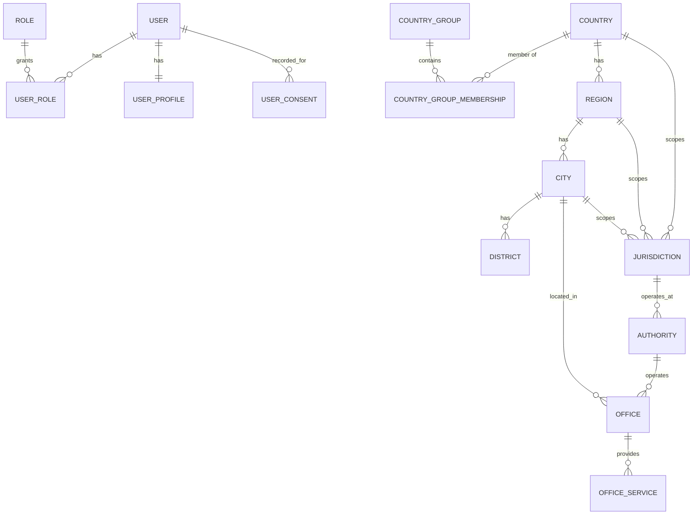
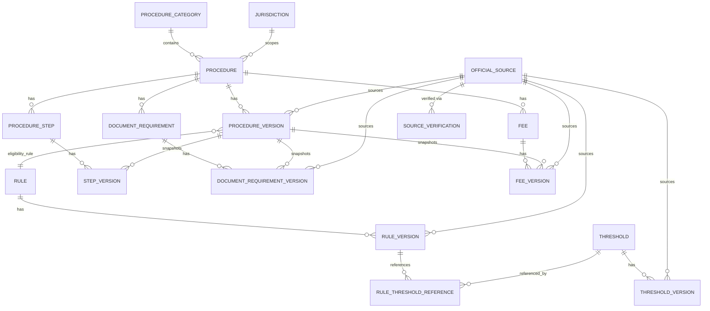
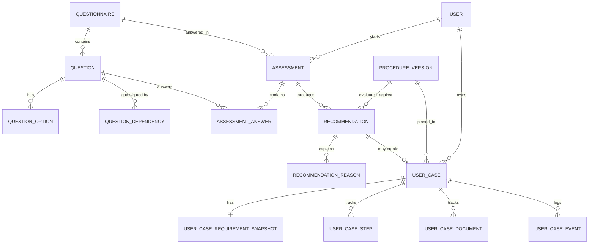

# Database Design — Foreigner Warsaw

Status: DRAFT (Phase 0)
Last updated: 2026-09-01

Companion to [ARCHITECTURE.md](../architecture/ARCHITECTURE.md) §4/§7/§8 — this document
is the schema-level source of truth; ARCHITECTURE.md's entity list points here for
detail. PostgreSQL 18, Flyway-migrated (ADR-002).

## 0. Conventions used throughout this document

These four patterns recur across almost every entity group below; naming them once
avoids repeating the rationale forty times.

### Identity + Version split

Legally significant content (`Procedure`, `ProcedureStep`, `DocumentRequirement`, `Fee`,
`Threshold`, `Rule`) is modeled as a stable **identity** row (has a permanent `code`,
never changes meaning) plus append-only **version** rows (`ProcedureVersion`,
`StepVersion`, `DocumentRequirementVersion`, `FeeVersion`, `ThresholdVersion`,
`RuleVersion`) carrying the actual content, `effective_from`/`effective_to`, `status`,
and `source_id`. A version row is **never** updated after creation except to close its
`effective_to` or move it through the status lifecycle (§4). This is ADR-004 at the
column level.

Each `*Version` child of a `ProcedureVersion` (steps, documents, fees) is a **full
snapshot copied at draft-creation time**, not a diff — even fields that didn't change
get a new row. This trades a small amount of duplication (these are short content rows,
not large blobs) for a much simpler guarantee: "give me everything shown to a user under
`ProcedureVersion` X" is one join, never a diff-reconstruction.

### The Active-Version Predicate

Every place the **production** rules/recommendation/procedure-display code reads a
`*Version` table, it applies the same filter — this is the mechanism behind Deliverable
requirements §9 (publication safety) and §10 (temporal evaluation):

```sql
WHERE status = 'PUBLISHED'
  AND effective_from <= :evaluationDate
  AND (effective_to IS NULL OR effective_to > :evaluationDate)
```

`DRAFT` / `IN_REVIEW` / `APPROVED` rows are invisible to this predicate no matter what —
an admin can draft and even approve a change weeks in advance without any risk of it
leaking into production output, because only the `PUBLISHED` transition (§4) makes a row
reachable at all, and even then only once its own `effective_from` arrives. `:evaluationDate`
defaults to "now" for a live assessment, but a `UserCase` stores the evaluation date and
the exact version IDs it was built from (§8.5), so a historical case can be replayed
using its own stored date/versions instead of today's — this is what makes old cases
reproducible even after the law changes.

### Business codes alongside UUIDs

Every entity referenced from a rule condition, a URL, or another document uses a UUID
primary key **plus** a stable, human-assigned `code` (`Country.code = PK`,
`Procedure.code = TEMP_RESIDENCE_WORK`, `Question.code = CURRENT_LEGAL_STATUS`,
`Rule.code = TR_WORK_BASE_ELIGIBILITY`, `Threshold.code = BLUE_CARD_MIN_SALARY`). The
UUID is what foreign keys use internally; the code is what a `RuleCondition` JSON
document, an admin screen, or a public URL segment uses, so rule definitions and support
conversations stay human-legible without a UUID lookup. Purely internal join/log tables
(`UserCaseEvent`, `AuditLog`, `RuleThresholdReference`) skip the code — nothing external
ever needs to refer to one of those rows by name.

### Delete behavior

- **Legal-content identities and versions** (Procedure, Rule, DocumentRequirement, Fee,
  Threshold and their `*Version`s, `OfficialSource`): never hard-deleted. Retirement is
  `is_active = false` (identity) or `status = 'ARCHIVED'` (version). This is required by
  ADR-004 and by the "show old cases as they were" requirement.
- **User accounts**: soft-deleted (`status = 'DELETED'`, PII columns nulled/scrubbed) to
  satisfy GDPR erasure while preserving referential integrity for `UserCase`/`AuditLog`
  rows that point at the user ID (tombstone, not orphaned FK).
- **Session-like / ephemeral data** (`EmailVerificationToken`, `PasswordResetToken`,
  superseded `Recommendation` rows): hard-deleted or naturally expired; no legal
  traceability requirement applies to them.
- **Everything else** (`UserProfile`, `NotificationPreference`, `Office`): ordinary
  mutable rows with `updated_at`; not append-only, since they represent current
  operational facts rather than legal history — see §3's note on why `Office` doesn't get
  a full version table.

---

## 1. Core user / security entities

### User
- **Purpose**: account identity and credentials.
- **Key columns**: `id UUID PK`, `email CITEXT NOT NULL`, `password_hash`,
  `email_verified_at NULL`, `status ENUM(ACTIVE, SUSPENDED, DELETED)`, `created_at`,
  `updated_at`.
- **Unique**: `UNIQUE(email)` on the case-insensitive `citext` column (or a functional
  `lower(email)` unique index if `citext` extension is undesired) — email uniqueness must
  not depend on case.
- **Indexes**: unique index on `email` (covers login lookups).
- **Delete**: soft-delete (§0).

### Role / UserRole
- **Role**: `id UUID PK`, `code UNIQUE` (`USER`, `ADMIN`, `CONSULTANT`,
  `LEGAL_REVIEWER`, `CONTENT_EDITOR`, `COMPANY_ADMIN` — only `USER`/`ADMIN` seeded in
  MVP), `name`.
- **UserRole**: composite `PK(user_id, role_id)`, both FK, `granted_at`, `granted_by FK
  → User NULL`.

### UserProfile
- **Purpose**: durable "Complete your profile" facts, reused as defaults across
  assessments — distinct from `AssessmentAnswer`, which is an immutable per-assessment
  snapshot even when it happens to match the profile.
- **Key columns**: `id UUID PK`, `user_id UUID UNIQUE FK → User`, `first_name NULL`,
  `preferred_locale`, `citizenship_country_id FK → Country NULL`,
  `current_city_id FK → City NULL`, `date_of_birth NULL`, `updated_at`.

### EmailVerificationToken / PasswordResetToken
- **Purpose**: single-use, expiring tokens for the two flows in Product Requirements
  §6.1.
- **Key columns** (both tables, same shape): `id UUID PK`, `user_id FK → User`,
  `token_hash UNIQUE` (store a hash, never the raw token), `expires_at`, `used_at NULL`,
  `created_at`.
- **Delete**: hard-deleted by a scheduled cleanup once expired/used; no history value.

### UserConsent
- **Purpose**: provable GDPR consent trail (ToS, Privacy Policy, optional marketing).
- **Key columns**: `id UUID PK`, `user_id FK → User`, `consent_type ENUM
  (TERMS_OF_SERVICE, PRIVACY_POLICY, MARKETING_EMAILS)`, `policy_version` (the ToS/Privacy
  text version accepted), `accepted_at`, `ip_address NULL`.
- **Versioning**: append-only — a new policy version requires a new consent row, the old
  one is never overwritten (this row *is* the audit record).

---

## 2. Geographic / reference entities

The hierarchy required — `Poland → Mazowieckie → Warsaw → district → office`, extensible
to `Poland → Małopolskie → Kraków` — is split into two layers that are easy to conflate
but serve different purposes:

- **Geography** (`Country`, `Region`, `City`, `District`) is *where a place is* — used
  for addresses, office locations, and routing a user to the right district office.
- **Jurisdiction** is *at what legal/procedural scope a rule, procedure, or authority
  operates* — National / Regional / Municipal — and is what `Procedure`, `Rule`, and
  `Authority` actually reference. This is the schema form of ARCHITECTURE.md §9's
  three-layer model.

A deliberate naming departure from the original brief: the brief lists "Voivodeship" as
its own entity. It's implemented here as `Region` with a `region_type` column
(`VOIVODESHIP` today) rather than a table literally named `Voivodeship`, because the
entire point of §84 of the originating brief is that Poland's administrative-division
concept must not be baked into the schema — a future German city's `Land` or French
`région` is another `Region` row with a different `region_type`, not a new table or a
code change. "Voivodeship" survives as data, not as structure.

### Country
- `id UUID PK`, `code CHAR(2) UNIQUE NOT NULL` (ISO 3166-1 alpha-2), `name`, `created_at`.
- **Index**: unique index on `code` (also the lookup path for classification).
- Seeded with the full ISO 3166 list (Phase 3).

### CountryGroup / CountryGroupMembership
- **CountryGroup**: `id UUID PK`, `code UNIQUE` (`EU_MEMBER`, `EEA_EFTA`, `SCHENGEN`,
  `UK_WITHDRAWAL_AGREEMENT`, ...), `name`, `description`.
- **CountryGroupMembership**: `id UUID PK`, `country_id FK → Country`,
  `country_group_id FK → CountryGroup`, `valid_from DATE`, `valid_to DATE NULL`.
  Membership is **time-bounded on purpose** — the UK's EU membership ending in 2020 is
  the textbook case a static membership table would get wrong for any pre-2020
  historical evaluation.
- **Unique**: `(country_id, country_group_id, valid_from)`.
- **Index**: `(country_group_id, valid_from, valid_to)` for "who is in the EU as of date
  X"; `(country_id)` for "what groups is this country in."
- This table is what derives `CitizenshipClassification` in
  [ASSESSMENT_DECISION_TREE.md](../product/ASSESSMENT_DECISION_TREE.md) — application
  code asks "is `country_id` a member of `EU_MEMBER` as of today," never
  `if (country == "DE")`.

### Region, City, District
- **Region**: `id UUID PK`, `country_id FK → Country`, `code` (`MAZOWIECKIE`,
  `MALOPOLSKIE`), `name`, `region_type` (`VOIVODESHIP`, ...). Unique `(country_id, code)`.
- **City**: `id UUID PK`, `region_id FK → Region`, `code` (`WARSAW`, `KRAKOW`), `name`,
  `is_active BOOLEAN NOT NULL DEFAULT false`. Unique `(region_id, code)`. **`is_active`
  is literally how "Warsaw is the only enabled city in V1" is implemented** — enabling
  Kraków later is `UPDATE city SET is_active = true WHERE code = 'KRAKOW'` plus seeding
  its districts/offices, not a deployment.
- **District**: `id UUID PK`, `city_id FK → City`, `code`, `name`. Unique `(city_id,
  code)`. Seeded with Warsaw's official districts (Phase 3).

### Jurisdiction
- **Purpose**: the legal/procedural scope a `Procedure`, `Rule`, or `Authority` operates
  at.
- **Key columns**: `id UUID PK`, `code UNIQUE` (`PL`, `PL_MAZOWIECKIE`,
  `PL_MAZOWIECKIE_WARSAW`), `level ENUM(NATIONAL, REGIONAL, MUNICIPAL)`,
  `country_id FK → Country NOT NULL`, `region_id FK → Region NULL`,
  `city_id FK → City NULL`.
- **Constraint**: `CHECK` — `level = NATIONAL` requires `region_id IS NULL AND city_id IS
  NULL`; `REGIONAL` requires `region_id IS NOT NULL AND city_id IS NULL`; `MUNICIPAL`
  requires `city_id IS NOT NULL`.
- Most immigration-eligibility `Procedure`s are `NATIONAL` even though *processing*
  happens at the Mazowieckie voivodeship office — see §7's example of composing a
  National rule with Regional and Municipal presentation data on the same page.

### Authority
- **Purpose**: an institution with a legal mandate (UDSC, Mazowieckie Voivodeship
  Office, City of Warsaw), as opposed to `Office`, which is a physical place that
  institution operates.
- `id UUID PK`, `code UNIQUE` (`UDSC`, `MAZOWIECKIE_VOIVODESHIP_OFFICE`,
  `WARSAW_CITY_HALL`), `name`, `jurisdiction_id FK → Jurisdiction`, `website`.

### Office / OfficeService / ProcedureOffice
- **Office**: `id UUID PK`, `authority_id FK → Authority`, `name`, `street`,
  `postal_code`, `city_id FK → City`, `district_id FK → District NULL`,
  `latitude/longitude NULL`, `phone`, `email`, `website`,
  `opening_hours JSONB` (genuinely irregular per-office schedules — a justified JSONB
  use, see §6), `appointment_required BOOLEAN`, `booking_url`, `notes`,
  `valid_from`, `valid_to NULL`, `source_id FK → OfficialSource`, `updated_at`.
  Deliberately **not** a full identity+version entity like Procedure/Rule: an office's
  address is an operational fact admins correct, not a legal position that needs
  DRAFT→PUBLISHED review — `valid_from`/`valid_to` plus a source is enough to know "when
  did we believe this was the address," without the heavier workflow (§0's delete/version
  conventions).
- **OfficeService**: `office_id FK`, `service_code` (`PESEL`, `MELDUNEK`,
  `DRIVING_LICENCE_EXCHANGE`, ...) — generic "this office handles X" tagging used for
  routing when no procedure-specific mapping exists. `PK(office_id, service_code)`.
- **ProcedureOffice**: `procedure_id FK → Procedure`, `office_id FK → Office`,
  `valid_from`, `valid_to NULL`, `notes` — explicit "this office handles this specific
  procedure" mapping (e.g. Śródmieście district office for PESEL applicants without a
  registerable address). References the `Procedure` identity, not a specific
  `ProcedureVersion` — office routing is administrative, not legal content.

---

## 3. Procedure / content entities

### ProcedureCategory
- `id UUID PK`, `code UNIQUE` (`RESIDENCE`, `WORK`, `STUDY`, `FAMILY`, `DRIVING`,
  `ADMINISTRATIVE`, `BUSINESS`, `LONG_TERM_STAY`), `parent_category_id FK →
  ProcedureCategory NULL` (self-referencing, for "Residence → Temporary Residence →
  Work"), `name`, `display_order`.

### Procedure (identity)
- `id UUID PK`, `code UNIQUE` (`TEMP_RESIDENCE_WORK`), `category_id FK →
  ProcedureCategory`, `jurisdiction_id FK → Jurisdiction`, `is_active BOOLEAN`,
  `created_at`.

### ProcedureVersion
- `id UUID PK`, `procedure_id FK → Procedure`, `version_number INT`,
  `status ENUM(DRAFT, IN_REVIEW, APPROVED, PUBLISHED, ARCHIVED)`,
  `effective_from DATE`, `effective_to DATE NULL`, `title`, `summary`,
  `eligibility_rule_id FK → Rule`, `source_id FK → OfficialSource`,
  `created_by/created_at`, `approved_by/approved_at NULL`, `published_at NULL`.
- **Unique**: `(procedure_id, version_number)`.
- **Integrity beyond a plain unique constraint**: published versions of the same
  procedure must not have overlapping effective ranges (§0's Active-Version Predicate
  depends on at most one `PUBLISHED` row matching any given date). Enforced with a
  PostgreSQL exclusion constraint using the `btree_gist` extension:
  `EXCLUDE USING gist (procedure_id WITH =, daterange(effective_from, effective_to) WITH
  &&) WHERE (status = 'PUBLISHED')`.
- **Index**: `(procedure_id, status, effective_from, effective_to)` — the Active-Version
  Predicate's lookup path.

### ProcedureStep (identity) / StepVersion
- **ProcedureStep**: `id UUID PK`, `procedure_id FK → Procedure`, `code`
  (`STEP_PREPARE_EMPLOYMENT_DOCS`), `default_order INT`.
- **StepVersion**: `id UUID PK`, `procedure_step_id FK → ProcedureStep`,
  `procedure_version_id FK → ProcedureVersion`, `order_index INT`, `title`,
  `description`, `is_online_available BOOLEAN`, `source_id FK → OfficialSource`,
  `status` (mirrors the parent `ProcedureVersion`'s lifecycle — a `StepVersion` is only
  ever created as part of drafting a `ProcedureVersion` and moves through the same
  publish workflow together with it, so it does not carry independent
  `effective_from`/`effective_to`).
- **Unique**: `(procedure_version_id, procedure_step_id)`.

### DocumentRequirement (identity) / DocumentRequirementVersion
- **DocumentRequirement**: `id UUID PK`, `procedure_id FK → Procedure`, `code`
  (`DOC_EMPLOYMENT_CONTRACT`), `name`.
- **DocumentRequirementVersion**: `id UUID PK`,
  `document_requirement_id FK → DocumentRequirement`,
  `procedure_version_id FK → ProcedureVersion`, `required BOOLEAN`,
  `conditional BOOLEAN`, `condition_rule_id FK → Rule NULL` (e.g. "only if
  `Q_HIGHLY_QUALIFIED = true`"), `translation_required`, `sworn_translation_required`,
  `apostille_required`, `legalisation_required`, `validity_period`,
  `number_of_copies`, `notes`, `source_id FK → OfficialSource`, `status`
  (mirrors parent version, as with `StepVersion`).
- **Unique**: `(procedure_version_id, document_requirement_id)`.

### Fee (identity) / FeeVersion
- **Fee**: `id UUID PK`, `procedure_id FK → Procedure`, `code`
  (`FEE_TEMP_RESIDENCE_PERMIT`), `name`.
- **FeeVersion**: `id UUID PK`, `fee_id FK → Fee`, `procedure_version_id FK →
  ProcedureVersion`, `amount NUMERIC(10,2)`, `currency CHAR(3)`, `fee_type`,
  `payment_instructions`, `source_id FK → OfficialSource`, `status`.
- **Unique**: `(procedure_version_id, fee_id)`.

### Threshold (identity) / ThresholdVersion
- **Threshold**: `id UUID PK`, `code UNIQUE` (`BLUE_CARD_MIN_SALARY`,
  `TR_WORK_MIN_SALARY`), `name`, `unit` (`PLN_PER_MONTH`).
- **ThresholdVersion**: `id UUID PK`, `threshold_id FK → Threshold`,
  `value NUMERIC(12,2)`, `effective_from DATE`, `effective_to DATE NULL`,
  `status ENUM(DRAFT, IN_REVIEW, APPROVED, PUBLISHED, ARCHIVED)`,
  `source_id FK → OfficialSource`. This is the entity a `RuleCondition` points at instead
  of embedding a number — e.g. GUS's annual Blue Card salary announcement becomes a new
  `ThresholdVersion` row, not a Java constant or a rule edit.
- **Same exclusion-constraint pattern as ProcedureVersion**, keyed on `threshold_id`
  instead of `procedure_id`, to guarantee at most one `PUBLISHED` value applies on any
  given date.
- **Index**: `(threshold_id, status, effective_from, effective_to)`.

### OfficialSource / SourceVerification
- **OfficialSource**: `id UUID PK`, `authority`, `title`, `source_url`,
  `jurisdiction_id FK → Jurisdiction`, `language`, `source_type`, `published_date`,
  `effective_from`, `effective_to NULL`, `last_checked_at`, `last_verified_at`,
  `status ENUM(DRAFT, VERIFIED, NEEDS_REVIEW, OUTDATED, ARCHIVED)`, `notes`,
  `content_hash` (hash of the fetched page content, so a re-check can detect "did this
  page actually change" automatically even before full re-review).
- **Delete**: never — protected by FK from every `*Version` table that references it
  (`ON DELETE RESTRICT`); an `OfficialSource` referenced by a `PUBLISHED` version cannot
  be deleted (brief §93/§94).
- **SourceVerification**: `id UUID PK`, `source_id FK → OfficialSource`,
  `verified_by FK → User`, `verified_at`, `result ENUM(CONFIRMED_CURRENT,
  CONTENT_CHANGED, SOURCE_UNAVAILABLE)`, `notes` — the append-only log behind
  `last_verified_at`/freshness reporting (ARCHITECTURE.md §8, Source freshness).

---

## 4. Questionnaire entities

### Questionnaire
- `id UUID PK`, `code UNIQUE` (`WARSAW_ELIGIBILITY_WIZARD`), `name`, `is_active`.
- **Deliberately no `QuestionnaireVersion` lifecycle table.** Considered and rejected:
  unlike legal-content versions, an `AssessmentAnswer` row already stores the exact
  `question_id` and `value` given, which is a complete, immutable record of what was
  asked and answered — it doesn't depend on the `Question` definition staying frozen to
  remain meaningful. Retiring or editing a question is `is_active = false` on that one
  `Question` row plus a new one if its meaning changed, not a whole-questionnaire
  version bump. This keeps UX iteration cheap while the actual legal-traceability
  requirement (which lives on `Rule`/`Procedure`/`Threshold`, not on question wording)
  is unaffected.

### Question
- `id UUID PK`, `questionnaire_id FK → Questionnaire`, `code UNIQUE`
  (`CITIZENSHIP_COUNTRY`, `CURRENT_LEGAL_STATUS`, `PRIMARY_PURPOSE`,
  `MONTHLY_GROSS_SALARY`), `field_key` (the camelCase name `RuleCondition.field` and
  `AssessmentAnswer` use — e.g. `monthlyGrossSalary` — decoupling the rule-facing field
  name from the human-facing `code`), `question_type ENUM(SINGLE_SELECT, MULTI_SELECT,
  BOOLEAN, DATE, NUMBER, TEXT)`, `label_translation_key`, `help_text_translation_key`,
  `allow_unsure BOOLEAN`, `is_active`. Not coupled to any Angular type — the frontend
  wizard is a generic renderer driven by `question_type` + `QuestionOption` +
  `QuestionDependency`.

### QuestionOption
- `id UUID PK`, `question_id FK → Question`, `code`, `value`, `label_translation_key`,
  `display_order`.

### QuestionDependency
- `id UUID PK`, `question_id FK → Question` (the gated question),
  `depends_on_question_id FK → Question`, `operator` (**same enum as `RuleCondition`**,
  §5 — one shared evaluator implementation drives both "should this question show" and
  "does this rule match"), `value`/`reference`.
- Example: `Q_SALARY_GROSS_MONTHLY.dependsOn(Q_PURPOSE, IN, [WORK,
  HIGHLY_QUALIFIED_WORK])`.

### Assessment / AssessmentAnswer
- **Assessment**: `id UUID PK`, `user_id FK → User NULL` (nullable to allow starting the
  wizard before registering — see Product Requirements §6.3; an anonymous assessment is
  claimed by a user on registration), `anonymous_session_token NULL`,
  `questionnaire_id FK → Questionnaire`, `status ENUM(IN_PROGRESS, COMPLETED,
  ABANDONED)`, `started_at`, `completed_at NULL`,
  `evaluation_date DATE` (defaults to `completed_at`'s date; the value threaded into the
  Active-Version Predicate, §0).
- **AssessmentAnswer**: `id UUID PK`, `assessment_id FK → Assessment`,
  `question_id FK → Question`, `value JSONB` (handles scalar, multi-select array, or the
  `UNSURE` sentinel uniformly), `answered_at`.
- **Unique**: `(assessment_id, question_id)`.

---

## 5. Rule-engine entities

### Design decision: JSONB condition tree, not fully normalized condition rows

**Chosen: `RuleVersion.condition_tree JSONB`**, not a `RuleCondition` table modeling the
`ALL`/`ANY`/leaf tree as rows.

| | Structured `RuleCondition` rows | JSONB condition tree (chosen) |
|---|---|---|
| Recursive `ALL`/`ANY` nesting | Needs adjacency-list or nested-set modeling; recursive CTEs to reconstruct | Native — a tree is just a tree |
| Read/evaluate a whole rule | Multi-join reconstruction, then still walk it in memory | One row fetch, walk in memory (evaluation happens in Java either way) |
| Write a whole rule (admin save) | Multi-row insert/diff logic | One row insert |
| "Which rules use threshold X" | Trivial `WHERE reference_code = X` | Needs a companion extraction table (below) |
| Schema enforces condition shape | Yes, via FKs/columns | No — enforced by application-level JSON Schema validation on write |

The condition tree is read and evaluated as a unit by the Java rules engine — nothing
ever needs SQL to filter *inside* a single rule's logic, only to filter *which rules to
load*. That asymmetry is exactly what JSONB is good at and what a fully normalized
adjacency-list table is bad at (ADR-003 already made this call for the runtime
representation; this is the same call for storage, for the same reason).

The one real objection — "if it's opaque JSON, how do I find every rule affected by a
threshold change before I edit it" — is answered with a narrow companion table rather
than by normalizing the whole tree:

**RuleThresholdReference**: `rule_version_id FK → RuleVersion`, `threshold_code`,
`PRIMARY KEY(rule_version_id, threshold_code)`. Populated by the application whenever a
`RuleVersion.condition_tree` is saved, by walking the JSON once and extracting every
`reference` value. Gives the admin UI "these N rules reference `BLUE_CARD_MIN_SALARY`"
as a plain indexed query, without parsing JSON at query time.

Condition tree shape (validated by JSON Schema, not by the database):

```json
{
  "all": [
    { "field": "citizenshipGroup", "operator": "EQUALS", "value": "THIRD_COUNTRY" },
    { "field": "purpose", "operator": "IN", "value": ["WORK", "HIGHLY_QUALIFIED_WORK"] },
    { "field": "monthlyGrossSalary", "operator": "GREATER_THAN_OR_EQUAL", "reference": "BLUE_CARD_MIN_SALARY" }
  ]
}
```

Operator vocabulary (fixed, shared with `QuestionDependency`, §4): `EQUALS`,
`NOT_EQUALS`, `IN`, `NOT_IN`, `EXISTS`, `NOT_EXISTS`, `GREATER_THAN`,
`GREATER_THAN_OR_EQUAL`, `LESS_THAN`, `LESS_THAN_OR_EQUAL`, `BETWEEN`, `DATE_BEFORE`,
`DATE_AFTER`, `DURATION_GREATER_THAN`, `ALL`, `ANY`.

### Rule (identity) / RuleVersion
- **Rule**: `id UUID PK`, `code UNIQUE` (`TR_WORK_BASE_ELIGIBILITY`),
  `jurisdiction_id FK → Jurisdiction NULL`, `name`, `description`, `is_active`.
- **RuleVersion**: `id UUID PK`, `rule_id FK → Rule`, `version_number INT`,
  `status ENUM(DRAFT, IN_REVIEW, APPROVED, PUBLISHED, ARCHIVED)`, `effective_from DATE`,
  `effective_to DATE NULL`, `condition_tree JSONB`, `source_id FK → OfficialSource`,
  `created_by/created_at`, `approved_by/approved_at NULL`, `published_at NULL`.
- **Unique**: `(rule_id, version_number)`. Same non-overlapping-published-range exclusion
  constraint as `ProcedureVersion`/`ThresholdVersion`.
- **Index**: `(rule_id, status, effective_from, effective_to)` (Active-Version Predicate);
  GIN index on `condition_tree` if/when admin search needs to query inside it directly
  (not required for MVP evaluation, which loads the whole tree per rule).

### RuleOutcome
- **Purpose**: forward-looking extension point for rule composition/reuse (e.g. a
  reusable sub-rule `IS_HIGHLY_QUALIFIED_WORKER` whose boolean outcome other rules
  reference), **not required for MVP's evaluation model**, where each
  `ProcedureVersion.eligibility_rule_id` points at one top-level rule and "matched" is
  the only outcome that matters. Modeled minimally now rather than left undesigned:
  `id UUID PK`, `rule_version_id FK → RuleVersion`, `outcome_code`, `description`.
  Expand only when a concrete composable-rule need arises in Phase 6+ — avoid
  building outcome composition machinery MVP doesn't exercise.

---

## 6. Recommendation entities

Unlike everything in §3/§5, `Recommendation` rows are **not** append-only legal history —
they're a computed cache of "what did the engine conclude for this assessment's current
answers." If a user edits an earlier wizard answer and re-evaluates, the previous
`Recommendation` rows for that assessment are deleted and replaced, not versioned. The
distinction matters: legal content changing is a fact worth preserving forever;
`Recommendation` is a query result on top of stable legal content and stable answers, so
it doesn't need its own history.

### Recommendation
- `id UUID PK`, `assessment_id FK → Assessment`, `procedure_id FK → Procedure`,
  `procedure_version_id FK → ProcedureVersion` (the exact version evaluated — the actual
  provenance pointer, see §7), `rule_version_id FK → RuleVersion`,
  `match_type ENUM(PRIMARY_MATCH, POSSIBLE_ALTERNATIVE, MORE_INFORMATION_REQUIRED,
  NOT_APPLICABLE)`, `created_at`.
- **Unique**: `(assessment_id, procedure_id)`.
- **No confidence/probability column exists anywhere on this table or its children** —
  deliberate, per Product Requirements §7/§27 (never a synthesized "93% eligible").

### RecommendationReason
- `id UUID PK`, `recommendation_id FK → Recommendation`,
  `reason_type ENUM(MATCHED_CONDITION, FAILED_CONDITION, MISSING_INFORMATION)`,
  `condition_path` (a JSON-pointer-style path into the `RuleVersion.condition_tree`, e.g.
  `all[2]`, tying a displayed reason back to the exact leaf condition), `field_code
  NULL`, `explanation_translation_key`, `display_order`. This normalized list is what
  backs the UI's matched-conditions/failed-conditions/missing-information display
  (Product Requirements §6.3) — it's a small, flat, per-recommendation list, which is
  exactly what a normalized table (rather than JSONB) suits.

---

## 7. Data provenance / traceability

Every fact a user sees must resolve to a chain ending in an `OfficialSource`. Two
worked examples, matching the two the brief calls out directly:

```
"Document X is required"
  UserCaseDocument
    → document_requirement_version_id → DocumentRequirementVersion
        → source_id → OfficialSource

"Salary must meet threshold"
  RuleVersion (the eligibility rule's condition referencing a threshold code)
    → (resolved at evaluation time) ThresholdVersion active on evaluationDate
        → source_id → OfficialSource
```

General rule: every `*Version` table in §3 and §5 has a **mandatory, non-null**
`source_id FK → OfficialSource`. Publish validation (§8) rejects any version missing one.
`Recommendation`/`RecommendationReason`/`UserCaseEvent`/`AuditLog`/`RuleOutcome` are
computed or log data, not legal content, and are exempt from this requirement — but
`RecommendationReason` still carries a `condition_path` back into the `RuleVersion` that
produced it, so a user-visible explanation is always traceable to the rule (and, from
there, the rule's own source) that generated it.

---

## 8. User-case entities

### UserCase
- `id UUID PK`, `user_id FK → User`, `procedure_id FK → Procedure`,
  `procedure_version_id FK → ProcedureVersion NOT NULL` (pinned at creation —
  the anchor for "has this changed," §8.5), `recommendation_id FK → Recommendation
  NULL` (set if created from a guided recommendation rather than the browse flow),
  `office_id FK → Office NULL` (the user's chosen/routed office, once district-dependent
  routing applies), `status ENUM(DRAFT, ASSESSING, PREPARING, READY_TO_SUBMIT,
  SUBMITTED, WAITING, ADDITIONAL_DOCUMENTS_REQUIRED, DECISION_RECEIVED, APPROVED,
  REJECTED, APPEAL, COMPLETED, CANCELLED)`, `created_at`, `updated_at`. Not every
  procedure uses every status (brief §29) — enforced in the service layer per procedure
  category, not by the schema.
- **Index**: `(user_id, status)` — the dashboard's "my cases" query.

### UserCaseRequirementSnapshot
- **Purpose**: the concrete record of exactly what generated a case's checklist, so
  "requirements have changed since you created this case" (brief §36) is a comparison,
  not a guess.
- `id UUID PK`, `user_case_id UUID UNIQUE FK → UserCase`,
  `procedure_version_id FK → ProcedureVersion` (redundant copy of `UserCase`'s, kept here
  so this table is self-contained), `evaluation_date DATE` (the date used to resolve the
  Active-Version Predicate at case-creation time, enabling exact historical replay, §0),
  `rule_version_ids JSONB` (array — a case's eligibility may have depended on more than
  one rule), `step_version_ids JSONB`, `document_requirement_version_ids JSONB`,
  `fee_version_ids JSONB`, `threshold_version_ids JSONB` (captures the *exact*
  `ThresholdVersion` — e.g. which specific `BLUE_CARD_MIN_SALARY` figure — used, so a
  later salary-threshold change is visible as a diff, not silently reinterpreted),
  `snapshot_taken_at`.
- **"Requirements changed" check**: compare each stored version ID against the *current*
  Active-Version Predicate result for the same identity (`ProcedureStep`,
  `DocumentRequirement`, etc.) — a mismatch is a changed/added/removed item, rendered as
  the diff described in Product Requirements §6.5.

### UserCaseStep
- `id UUID PK`, `user_case_id FK → UserCase`, `procedure_step_id FK → ProcedureStep`
  (identity — stable even if wording changes later), `step_version_id FK → StepVersion`
  (pinned — what was actually shown), `status ENUM(TODO, IN_PROGRESS, DONE)`,
  `completed_at NULL`.
- **Unique**: `(user_case_id, procedure_step_id)`.

### UserCaseDocument
- `id UUID PK`, `user_case_id FK → UserCase`,
  `document_requirement_id FK → DocumentRequirement` (identity),
  `document_requirement_version_id FK → DocumentRequirementVersion` (pinned),
  `status ENUM(NOT_STARTED, MISSING, IN_PROGRESS, READY, NOT_APPLICABLE,
  NEEDS_UPDATE)`, `updated_at`. **No file/content column** — V1 stores checklist status
  only (Product Requirements, non-scope).
- **Unique**: `(user_case_id, document_requirement_id)`.

### UserCaseEvent
- `id UUID PK`, `user_case_id FK → UserCase`, `event_type` (`STATUS_CHANGED`,
  `DOCUMENT_MARKED_READY`, `REQUIREMENTS_CHANGE_ACKNOWLEDGED`, `NOTE_ADDED`, ...),
  `payload JSONB` (heterogeneous per `event_type` — a justified JSONB use: append-only,
  never queried by field, only replayed as a timeline), `created_at`,
  `created_by FK → User NULL` (null for system-generated events).
- **Distinct from `AuditLog`** (§9): this is the user-facing case timeline; `AuditLog` is
  the admin/system audit trail. Don't merge them — different audiences, different
  retention/access rules.
- **Index**: `(user_case_id, created_at)`.

---

## 9. Administration entities

### AdminReview
- `id UUID PK`, `target_type ENUM(PROCEDURE_VERSION, RULE_VERSION,
  DOCUMENT_REQUIREMENT_VERSION, FEE_VERSION, THRESHOLD_VERSION, OFFICIAL_SOURCE)`,
  `target_id UUID` (polymorphic — deliberately **not** an FK constraint, since it can
  point at any of six tables; integrity here is enforced by the admin service layer, not
  the database, which is an acceptable trade-off for a review/workflow log rather than
  primary content), `reviewer_id FK → User`, `decision ENUM(APPROVED, REJECTED,
  CHANGES_REQUESTED)`, `comments`, `reviewed_at`.

### AuditLog
- `id UUID PK`, `actor_user_id FK → User NULL` (null for system actions),
  `action` (`PROCEDURE_VERSION_PUBLISHED`, ...), `entity_type`, `entity_id UUID`
  (same polymorphic trade-off as `AdminReview`, for the same reason), `before_state
  JSONB NULL`, `after_state JSONB NULL`, `occurred_at`, `ip_address NULL`,
  `correlation_id`.
- **Index**: `(entity_type, entity_id)`, `(occurred_at)`.
- Append-only; never updated or deleted.

### Notification / NotificationPreference
- **Notification**: `id UUID PK`, `user_id FK → User`, `type` (`EMAIL_VERIFICATION`,
  `PASSWORD_RESET`, `PERMIT_EXPIRY_REMINDER`, `CASE_REMINDER`, `REQUIREMENTS_CHANGED`,
  `DOCUMENT_REMINDER`, `DEADLINE_REMINDER`), `channel ENUM(EMAIL, IN_APP)`,
  `payload JSONB`, `status ENUM(PENDING, SENT, FAILED, READ)`, `created_at`, `sent_at
  NULL`, `read_at NULL`.
- **NotificationPreference**: `PK(user_id, notification_type)`, `channel_enabled
  BOOLEAN`. Security-critical types (`EMAIL_VERIFICATION`, `PASSWORD_RESET`) are treated
  as always-on in application logic regardless of preference row — the one place a
  behavioral default is a code constant rather than data, because it's a security
  control, not legal/procedural content.

### Translation
- `id UUID PK`, `translation_key`, `locale VARCHAR(5)`, `value TEXT`, `updated_at`.
  Unique `(translation_key, locale)`. Scope for V1: UI chrome and question
  labels/help text (short, reusable strings). Longer per-procedure content (titles,
  summaries, step descriptions) is **not yet resolved** to a specific localization
  schema — likely a `ContentTranslation(entity_type, entity_id, field_name, locale,
  value)` table keyed to `*Version` row IDs, deferred to Phase 10 when Polish-language
  procedure content is actually authored, rather than guessed at now.

---

## 10. Entity-relationship diagrams

### 10.1 Identity, geography, jurisdiction



### 10.2 Procedure content, rules, sources



### 10.3 Assessment → recommendation → case



---

## 11. Indexing strategy

Deliberately not exhaustive — indexes are added where a known query pattern needs one,
not on every column:

- `user.email` (unique, login lookup)
- `country.code`, `procedure.code`, `rule.code`, `threshold.code` (unique, code-based
  lookups from rule conditions / URLs / admin search)
- `(procedure_id/rule_id/threshold_id, status, effective_from, effective_to)` on every
  `*Version` table — the Active-Version Predicate's lookup path, exercised on every
  assessment evaluation and every procedure page view; this is the single
  highest-traffic index family in the schema
- `official_source.status` (freshness dashboards filtering by `NEEDS_REVIEW`/`OUTDATED`)
- `user_case.(user_id, status)` (dashboard "my cases")
- `user_case_event.(user_case_id, created_at)` (case timeline, chronological)
- `audit_log.(entity_type, entity_id)` and `(occurred_at)` (admin history lookups)
- `rule_threshold_reference.(threshold_code)` (impact analysis on threshold changes)
- `country_group_membership.(country_group_id, valid_from, valid_to)` (temporal
  membership lookups)

GIN indexes on JSONB columns (`condition_tree`, `payload`) are deferred until a concrete
query needs to filter *inside* the JSON — none of the MVP access patterns require it, so
adding them now would be premature.

## 12. UUID usage

UUID primary keys on every domain/public entity (everything above) for three reasons:
mergeable across environments without collision (useful once seed data, admin-authored
content, and Testcontainers-generated test data all need to coexist), no
information leakage through sequential IDs in URLs (`/procedures/{id}`), and safe to
reference before a transaction commits (client-generated IDs are not required for MVP
but the option stays open). Pure join tables with no independent identity of their own
(`UserRole`, `RuleThresholdReference`, `OfficeService`) use their composite natural key
as the primary key instead — a surrogate UUID would add nothing there.
